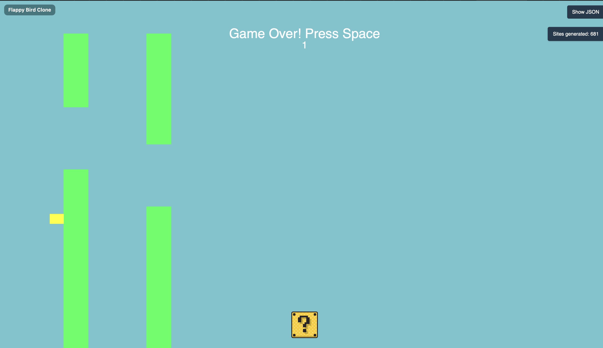
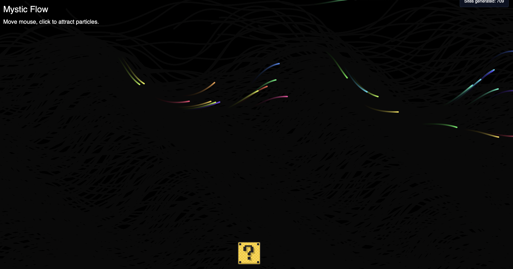
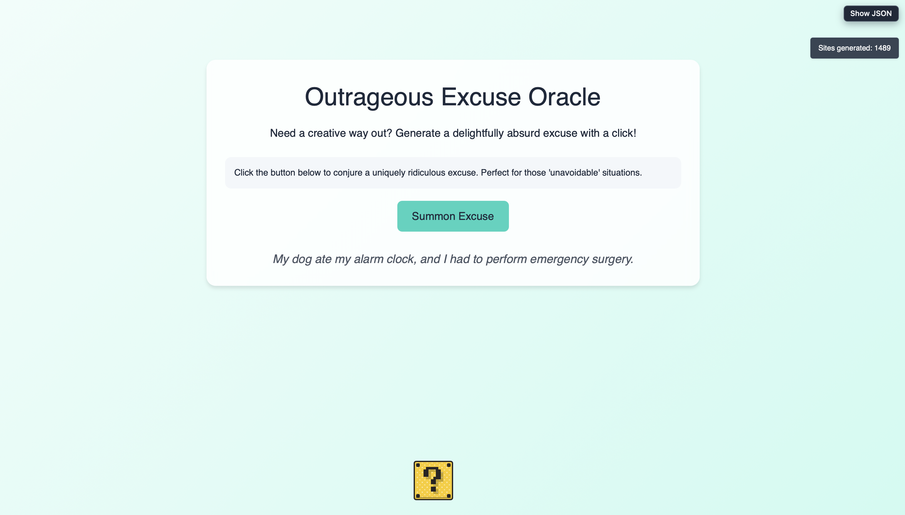
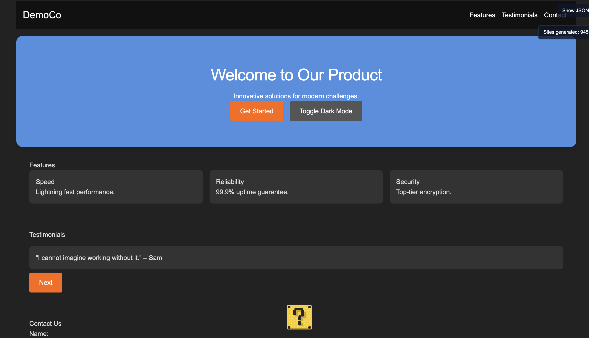
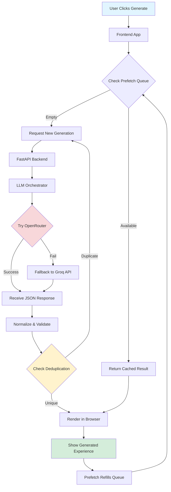

# Non-Deterministic Website

> **Generate a brand-new interactive experience with every click.** This project uses AI to create unique, interactive web pages and games on demand—no two generations are ever the same.

##  What Is This?

Non-Deterministic Website is an experimental platform that leverages large language models (LLMs) to generate interactive web experiences in real-time. Each generation produces something unique:

-  **Interactive games** with canvas animations, player controls, and game loops
-  **Complete web pages** with layouts, styling, and interactive elements  
-  **Dynamic content** that adapts to user prompts or generates creative themes automatically

The system ensures variety through intelligent deduplication, category rotation, and prompt engineering—so you'll never see the same experience twice.

##  Screenshots

<div align="center">

### Example Generated Experiences

<table>
  <tr>
    <td width="50%" align="center">
      
      <br/>
      <em>Generated Page - Removed Game Category</em>
    </td>
    <td width="50%" align="center">
      
      <br/>
      <em>Generated Interactive Experience</em>
    </td>
  </tr>
  <tr>
    <td width="50%" align="center">
      
      <br/>
      <em>Generated Experience</em>
    </td>
    <td width="50%" align="center">
      
      <br/>
      <em>Generated Experience</em>
    </td>
  </tr>
</table>

</div>

##  How It Works



### Architecture Components

| Component | Location | Purpose |
|-----------|----------|---------|
| **Frontend UI** | `templates/index.html`<br/>`static/ts-src/app.ts` | Landing page, generation controls, rendering engine |
| **NDW Runtime** | `static/ts-src/ndw.ts` | Custom JavaScript runtime for games: `loop(dt)`, input handling, canvas helpers, RNG |
| **API Backend** | `api/main.py` | FastAPI server exposing `/generate`, `/metrics`, `/prefetch` endpoints |
| **LLM Client** | `api/llm_client.py` | Orchestrates OpenRouter-first with Groq fallback, retries, prompt engineering |
| **Prefetch Engine** | `api/prefetch.py` | Background queue that pre-generates experiences for instant delivery |
| **Deduplication** | `api/dedupe.py` | Content fingerprinting to prevent near-identical outputs |
| **Validators** | `api/validators.py` | JSON schema validation and normalization |
| **Compliance Reviewer (optional)** | `api/llm_client.py` | Calls Gemini to audit or auto-fix generations before serving and caches reviewer notes |
| **Node.js Tooling** | `package.json`, `static/ts-src/` | Tailwind + TypeScript build pipeline for frontend assets |

##  Quick Start

### Prerequisites
- Python 3.9+
- Node.js 16+
- API keys for [Groq](https://groq.com) and/or [OpenRouter](https://openrouter.ai)

### Installation

1. **Clone the repository**
   ```bash
   git clone https://github.com/lesprgm/non-deterministic-website.git
   cd non-deterministic-website
   ```

2. **Set up Python environment**
   ```bash
   python3 -m venv venv
   source venv/bin/activate  # On Windows: venv\Scripts\activate
   pip install -r requirements.txt
   ```

3. **Install Node dependencies**
   ```bash
   npm install
   ```

4. **Configure API keys**
   
   Create a `.env` file in the project root:
   ```bash
   GROQ_API_KEY=your_groq_api_key_here
   OPENROUTER_API_KEY=your_openrouter_api_key_here
   ```

5. **Build frontend assets**
   ```bash
   npm run build
   ```

6. **Start the server**
   ```bash
   uvicorn api.main:app --reload
   ```

7. **Open your browser**
   
   Navigate to `http://localhost:8000` and click "Generate" to create your first experience!

### Development Mode

For active development with auto-reloading:

```bash
# Terminal 1: Watch and rebuild TypeScript + CSS
npm run watch

# Terminal 2: Run FastAPI with hot reload
uvicorn api.main:app --reload
```

##  How to Use

1. **Visit the landing page** at `http://localhost:8000`
2. **Click "Generate"** to create a random interactive experience
3. **Interact with the result** - click, drag, use arrow keys, etc.
4. **Generate again** to get something completely different!

### API Endpoints

| Endpoint | Method | Description |
|----------|--------|-------------|
| `/` | GET | Landing page with generation controls |
| `/generate` | POST | Generate a new experience (returns JSON or HTML) |
| `/generate/stream` | POST | Streaming generation with progress updates |
| `/metrics/total` | GET | Count of total generated experiences |
| `/prefetch/status` | GET | Check prefetch queue status |
| `/prefetch/fill` | POST | Manually refill prefetch queue |
| `/llm/status` | GET | LLM provider configuration and status |
| `/llm/probe` | GET | Test LLM provider connectivity |

##  Configuration

Configure behavior via environment variables:

### LLM Provider Settings

| Variable | Description | Default |
|----------|-------------|---------|
| `GROQ_API_KEY` | Groq API authentication key | (required) |
| `GROQ_MODEL` | Primary Groq model | `meta-llama/llama-4-scout-17b-16e-instruct` |
| `GROQ_FALLBACK_MODEL` | Backup model if primary fails | `llama-3.1-8b-instant` |
| `GROQ_MAX_TOKENS` | Max output tokens for Groq | `15000` |
| `OPENROUTER_API_KEY` | OpenRouter API key (primary) | (required for production) |
| `OPENROUTER_MODEL` | Primary OpenRouter model | `google/gemma-3n-e2b-it:free` |
| `OPENROUTER_FALLBACK_MODEL_1` | First OpenRouter fallback | `x-ai/grok-4-fast` |
| `OPENROUTER_FALLBACK_MODEL_2` | Second OpenRouter fallback | `deepseek/deepseek-chat-v3.1:free` |
| `FORCE_OPENROUTER_ONLY` | Force skipping Groq fallback | `false` |
| `LLM_TIMEOUT_SECS` | Request timeout in seconds | `75` |
| `GEMINI_REVIEW_ENABLED` | Enable Gemini-based compliance review | `false` |
| `GEMINI_API_KEY` | Google AI Studio API key for Gemini reviewer | (optional) |
| `GEMINI_REVIEW_MODEL` | Gemini reviewer model slug | `gemini-1.5-flash-latest` |

### Prefetch & Caching

| Variable | Description | Default |
|----------|-------------|---------|
| `PREFETCH_ENABLED` | Enable background prefetch | `true` |
| `PREFETCH_DIR` | Directory for cached generations | `cache/prefetch` |
| `PREFETCH_LOW_WATER` | Queue size to trigger refill | `15` |
| `PREFETCH_FILL_TO` | Target queue size after refill | `20` |
| `DEDUPE_ENABLED` | Enable duplicate detection | `true` |
| `DEDUPE_RECENT_FILE` | Deduplication database file | `cache/seen_pages.json` |
| `PREFETCH_REVIEW_BATCH` | Number of items generated per restock batch | `3` |
| `PREFETCH_PREWARM_COUNT` | Number of docs to generate before startup | `0` |

Prefetched experiences are saved as JSON files in `cache/prefetch`. Every `/generate`
request—regardless of which user triggers it—consumes the oldest entry before calling the
LLM again. That means each prefetched page only costs one model invocation, and whichever
user arrives next gets the cached experience until the queue empties.

### Other Settings

| Variable | Description | Default |
|----------|-------------|---------|
| `ALLOW_OFFLINE_GENERATION` | Use stub generation (no LLM) for testing | `false` |
| `ALLOW_ORIGINS` | CORS allowed origins (comma-separated) | `*` |

##  Testing

Run the full test suite:

```bash
pytest
```

Run specific test categories:

```bash
# Test LLM generation and prompt engineering
pytest tests/test_llm_generation.py

# Test frontend rendering
pytest tests/test_snippet_render_dom.py

# Test prefetch system
pytest tests/test_prefetch.py

# Test with coverage
pytest --cov=api --cov-report=html
```

The test suite includes **70+ tests** covering:
-  Prompt engineering and LLM response validation
-  NDW runtime behavior and safety checks
-  Schema normalization and validation
-  Deduplication logic
-  Prefetch queue management
-  API endpoint behavior
-  Frontend rendering (full HTML and NDW snippets)
-  Gemini compliance reviewer integration (when enabled)

##  Deployment

### Deploy to Render

This project includes a `render.yaml` blueprint for one-click deployment:

1. **Push to GitHub**
   ```bash
   git push origin main
   ```

2. **Create Render Service**
   - Go to [Render Dashboard](https://dashboard.render.com/)
   - Click **New > Blueprint**
   - Connect your GitHub repository
   - Render will detect `render.yaml` automatically

3. **Configure Environment Variables**
   
   Add these in the Render dashboard under "Environment":
   - `GROQ_API_KEY`
   - `OPENROUTER_API_KEY` (optional)
   - Any other custom settings from the Configuration section

4. **Deploy**
   
   Render will automatically:
   - Install Python dependencies
   - Install Node dependencies  
   - Build frontend assets with `npm run build`
   - Start the server with Uvicorn
   - Auto-deploy on future pushes

### Manual Deployment

For other platforms (Heroku, Railway, Fly.io, etc.):

1. **Build step**:
   ```bash
   pip install -r requirements.txt
   npm install
   npm run build
   ```

2. **Start command**:
   ```bash
   uvicorn api.main:app --host 0.0.0.0 --port $PORT
   ```

##  Project Goals & Design Principles

### Why "Non-Deterministic"?

Traditional websites show the same content every time. This project explores the opposite: **what if every visit generated something new?** By leveraging AI, we create:

- **Infinite variety** - No two generations are identical
- **Creative surprise** - Unexpected combinations and themes
- **Interactive experiences** - Games, simulations, and dynamic content
- **Instant gratification** - Prefetching makes it feel instantaneous

### Key Technical Decisions

1. **Two Rendering Modes**
   - **Full HTML pages**: Complete standalone experiences
   - **NDW snippets**: Lightweight canvas-based games/visuals using our custom runtime

2. **Smart Prefetching**
   - Background generation keeps a queue ready
   - Users get instant results without waiting for LLM latency
   - Queue automatically refills in the background

3. **Deduplication System**
   - Content fingerprinting prevents boring repetition
   - Recent generations are tracked and rejected if too similar
   - Ensures fresh, varied outputs

4. **Prompt Engineering**
   - Category rotation prevents repetitive themes
   - Strict JSON schema ensures parseable outputs
   - Runtime constraints (use `dt` for timing, proper game loop structure)
   - Automatic retry with fallback providers

5. **Quality Guardrails**
   - Schema validation catches malformed responses
   - Runtime safety checks (canvas creation, error overlays)
   - Comprehensive test coverage

##  Development

### Project Structure

```
non-deterministic-website/
├── api/                    # FastAPI backend
│   ├── main.py            # API routes and server
│   ├── llm_client.py      # LLM orchestration
│   ├── prefetch.py        # Background queue
│   ├── dedupe.py          # Duplicate detection
│   └── validators.py      # Schema validation
├── static/
│   ├── ts-src/            # TypeScript source
│   │   ├── app.ts         # Main frontend logic
│   │   └── ndw.ts         # NDW runtime
│   └── ts-build/          # Compiled JavaScript
├── templates/
│   └── index.html         # Landing page
├── tests/                 # Test suite
├── screenshots/           # Demo images
└── package.json           # Node dependencies
```

### Code Style

This project uses:
- **Python**: Black formatting, type hints preferred
- **TypeScript**: ESLint + Prettier
- **Tests**: pytest with extensive coverage

Format code before committing:

```bash
# Format Python
black api/ tests/

# Format TypeScript
npm run format

# Lint TypeScript
npm run lint
```

### Node.js Build Pipeline

Node.js powers the asset build workflow. The scripts in `package.json` run Tailwind’s CLI
(`npm run build:css`) and the TypeScript compiler (`npm run build:ts`) to produce
`static/tailwind.css` and the ES modules in `static/ts-build/`. During development you can
run `npm run watch` to keep both pipelines hot. Once those assets exist, the FastAPI server
serves them directly—no Node.js runtime is required in production.

##  Additional Resources

- **Groq API Docs**: https://console.groq.com/docs
- **OpenRouter API Docs**: https://openrouter.ai/docs
- **FastAPI Documentation**: https://fastapi.tiangolo.com/
- **Mermaid Diagrams**: https://mermaid.js.org/

##  Contributing

Contributions welcome! Areas for improvement:

-  New prompt engineering techniques
-  Additional validation logic
-  NDW runtime features (WebGL, audio, etc.)
-  Metrics dashboard
-  Visual diff testing for generated pages

## License

MIT License - see [LICENSE](LICENSE) file for details.

---

**Built with ❤️ by Leslie** | [Report Issues](https://github.com/lesprgm/non-deterministic-website/issues) | [View Source](https://github.com/lesprgm/non-deterministic-website)
