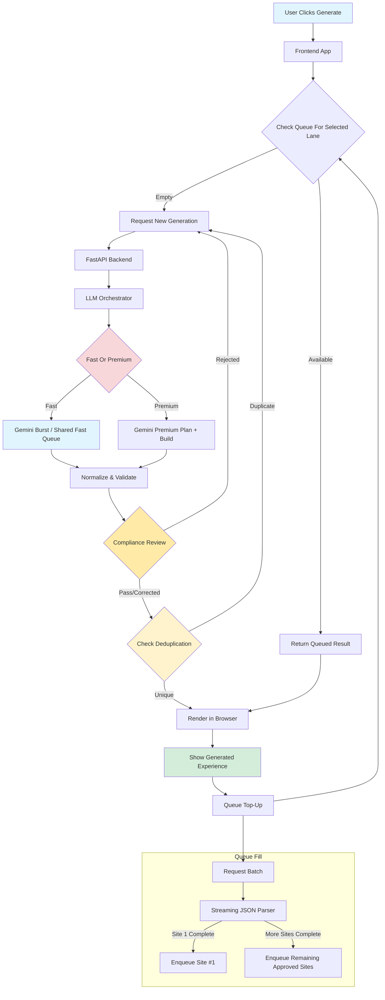

# Non-Deterministic Website

> **Enter a different world with every click.** This project is a randomness-first AI roulette that serves a new interactive website on each visit.

**Live Demo:** [non-deterministic-website.onrender.com](https://non-deterministic-website.onrender.com)

## What Is This?

Non-Deterministic Website is an experimental platform that leverages large language models (LLMs) to generate interactive web experiences in real time. The product is intentionally **not** prompt-to-site. Users click into a random world, and the backend serves whichever generated experience is next in the lane they chose.

Each generation can produce something different:

- **Interactive games** with canvas animations, player controls, and game loops
- **Complete web pages** with layouts, styling, and interactive elements
- **Dynamic content** that invents its own theme, mechanics, and visual direction

The system keeps novelty high through a few core ideas:

- **Gemini-first fast lane**: `fast` mode is the cheap bulk path. It prefers the shared fast queue and Gemini burst generation before using any secondary providers.
- **Shared premium lane**: `premium` is still random, but it uses a smaller Gemini high-effort queue with stricter compliance gating and a per-user quota.
- **Local design kit + planning**: premium generations use a compact planning pass and bundled local assets to produce more art-directed outputs without requiring expensive external assets.
- **Interactive-first runtime**: the generated app is always the centerpiece, with landing chrome disappearing as soon as the user enters a world.

## Screenshots

<div align="center">

### v1.5 Landing Page

<table>
  <tr>
    <td width="100%" align="center">
      
      <br/>
      <em>Landing Page</em>
    </td>
  </tr>
</table>

### v1.5 Generated Websites

<table>
  <tr>
    <td width="50%" align="center">
      
      <br/>
      <em>Generated Website</em>
    </td>
    <td width="50%" align="center">
      
      <br/>
      <em>Generated Website</em>
    </td>
  </tr>
  <tr>
    <td width="50%" align="center">
      
      <br/>
      <em>Generated Website</em>
    </td>
    <td width="50%" align="center">
      
      <br/>
      <em>Generated Website</em>
    </td>
  </tr>
</table>

### v1 Generated Websites

<table>
  <tr>
    <td width="50%" align="center">
      
      <br/>
      <em>Generated Website</em>
    </td>
    <td width="50%" align="center">
      
      <br/>
      <em>Generated Website</em>
    </td>
  </tr>
  <tr>
    <td width="50%" align="center">
      
      <br/>
      <em>Generated Website</em>
    </td>
    <td width="50%" align="center">
      
      <br/>
      <em>Generated Website</em>
    </td>
  </tr>
</table>

</div>

## How It Works


```mermaid
graph TD
    A[User Clicks Generate] --> B[Frontend App]
    B --> C{Check Queue For Selected Lane}
    C -->|Available| D[Return Queued Result]
    C -->|Empty| E[Request New Generation]
    E --> F[FastAPI Backend]
    F --> G[LLM Orchestrator]
    G --> H{Fast Or Premium}
    H -->|Fast| H2[Gemini Burst / Shared Fast Queue]
    H -->|Premium| H3[Gemini Premium Plan + Build]
    H2 --> I[Normalize & Validate]
    H3 --> I
    I --> L{Compliance Review}
    L -->|Pass/Corrected| M{Check Deduplication}
    L -->|Rejected| E
    M -->|Unique| N[Render in Browser]
    M -->|Duplicate| E
    N --> O[Show Generated Experience]
    O --> P[Queue Top-Up]
    P --> C
    D --> N

    subgraph Queue Fill
    P1[Request Batch]
    P2[Streaming JSON Parser]
    P3[Enqueue Site #1]
    P4[Enqueue Remaining Approved Sites]
    P1 --> P2
    P2 -->|Site 1 Complete| P3
    P2 -->|More Sites Complete| P4
    end
    P ---> P1

    style A fill:#e1f5ff
    style O fill:#d4edda
    style L fill:#ffeaa7
    style M fill:#fff3cd
    style H fill:#f8d7da
    style H2 fill:#e1f5ff
```

### Architecture Components

| Component                          | Location                                          | Purpose                                                                                        |
| ---------------------------------- | ------------------------------------------------- | ---------------------------------------------------------------------------------------------- |
| **Frontend UI**                    | `templates/index.html`<br/>`static/ts-src/app.ts` | Landing page, generation controls, rendering engine                                            |
| **NDW Runtime**                    | `static/ts-src/ndw.ts`                            | Custom JavaScript runtime for games: `loop(dt)`, input handling, canvas helpers, RNG           |
| **API Backend**                    | `api/main.py`                                     | FastAPI server exposing `/generate`, `/metrics`, `/prefetch` endpoints                         |
| **LLM Client**                     | `api/llm_client.py`                               | Gemini-first fast generation, Gemini premium planning/build, and emergency provider fallback.  |
| **Prefetch Engine**                | `api/prefetch.py`                                 | Shared fast and premium queues, preview tokens, Redis/file storage, and lane isolation.        |
| **Deduplication**                  | `api/dedupe.py`                                   | Content fingerprinting to prevent near-identical outputs                                       |
| **Validators / Quality**           | `api/validators.py`<br/>`api/quality.py`          | Schema validation, preflight checks, and lightweight structure scoring                         |
| **Compliance Reviewer (optional)** | `api/llm_client.py`                               | Calls Gemini to audit or auto-fix generations before serving and caches reviewer notes         |
| **Node.js Tooling**                | `package.json`, `static/ts-src/`                  | Tailwind + TypeScript build pipeline for frontend assets                                       |

## Quick Start

### Prerequisites

- Python 3.9+
- Node.js 16+
- A [Gemini API key](https://ai.google.dev/) for normal generation
- Optional fallback provider keys for [Groq](https://groq.com) and/or [OpenRouter](https://openrouter.ai)

### Installation

1. **Clone the repository**

   ```bash
   git clone https://github.com/lesprgm/non-deterministic-website.git
   cd non-deterministic-website
   ```

2. **Set up Python environment**

   ```bash
   python3 -m venv venv
   source venv/bin/activate  # On Windows: venv\Scripts\activate
   pip install -r requirements.txt
   ```

3. **Install Node dependencies**

   ```bash
   npm install
   ```

4. **Configure API keys**

   Create a `.env` file in the project root:

   ```bash
   GEMINI_API_KEY=your_gemini_api_key_here
   GROQ_API_KEY=your_groq_api_key_here
   OPENROUTER_API_KEY=your_openrouter_api_key_here
   ```

5. **Build frontend assets**

   ```bash
   npm run build
   ```

6. **Start the server**

   ```bash
   uvicorn api.main:app --reload
   ```

7. **Open your browser**

   Navigate to `http://localhost:8000` and click a preview or generate a new world.

### Development Mode

For active development with auto-reloading:

```bash
# Terminal 1: Watch and rebuild TypeScript + CSS
npm run watch

# Terminal 2: Run FastAPI with hot reload
uvicorn api.main:app --reload
```

## How to Use

1. **Visit the landing page** at `http://localhost:8000`
2. **Click a tunnel preview** to enter a queued random world instantly
3. **Use Generate** inside the runtime to jump to another world
4. **Switch Fast / Premium** from the generated-site controls if you want the scarcer premium lane

### API Endpoints

| Endpoint           | Method | Description                                      |
| ------------------ | ------ | ------------------------------------------------ |
| `/`                | GET    | Landing page with generation controls            |
| `/generate`        | POST   | Generate a new experience (returns JSON or HTML) |
| `/generate/stream` | POST   | Streaming generation with progress updates       |
| `/metrics/total`   | GET    | Count of sites actually served to users          |
| `/prefetch/status` | GET    | Check fast and premium queue status              |
| `/api/premium/previews` | GET | Admin/dev inspection of the premium lane       |
| `/prefetch/fill`   | POST   | Manually refill prefetch queue                   |
| `/llm/status`      | GET    | LLM provider configuration and status            |
| `/llm/probe`       | GET    | Test LLM provider connectivity                   |

## Configuration

Configure behavior via environment variables:

### LLM Provider Settings

| Variable                      | Description                           | Default                                     |
| ----------------------------- | ------------------------------------- | ------------------------------------------- |
| `GROQ_API_KEY`                | Groq API authentication key           | (optional emergency fallback)               |
| `GROQ_MODEL`                  | Groq fallback model                   | `openai/gpt-oss-120b`                       |
| `GROQ_FALLBACK_MODEL`         | Backup model if Groq primary fails    | `qwen/qwen3-32b`                            |
| `GROQ_MAX_TOKENS`             | Max output tokens for Groq            | `15000`                                     |
| `OPENROUTER_API_KEY`          | OpenRouter API key                    | (optional emergency fallback)               |
| `OPENROUTER_MODEL`            | Primary OpenRouter fallback model     | `z-ai/glm-4.7-flash`                        |
| `OPENROUTER_FALLBACK_MODEL_1` | First OpenRouter backup               | `google/gemini-2.0-flash-exp:free`          |
| `OPENROUTER_FALLBACK_MODEL_2` | Second OpenRouter backup              | `deepseek/deepseek-chat-v3.1:free`          |
| `FORCE_OPENROUTER_ONLY`       | Force skipping Gemini fast routing    | `false`                                     |
| `LLM_TIMEOUT_SECS`            | Request timeout in seconds            | `75`                                        |
| `GEMINI_GENERATION_MODEL`     | Primary Gemini generation model       | `gemini-3-flash-preview`                    |
| `GEMINI_REVIEW_ENABLED`       | Enable Gemini-based compliance review | `true`                                      |
| `GEMINI_API_KEY`              | Google AI Studio API key              | (optional)                                  |
| `GEMINI_REVIEW_MODEL`         | Gemini reviewer model slug            | `gemini-3-flash-preview`                    |
| `OPENROUTER_REVIEW_MODEL`     | OpenRouter compliance fallback model  | `openai/gpt-5-nano`                         |

### Prefetch & Caching

| Variable                 | Description                                 | Default                 |
| ------------------------ | ------------------------------------------- | ----------------------- |
| `PREFETCH_ENABLED`       | Enable background prefetch                  | `true`                  |
| `PREFETCH_DIR`           | Directory for cached generations            | `cache/prefetch`        |
| `PREFETCH_LOW_WATER`     | Queue size to trigger refill                | `15`                    |
| `PREFETCH_FILL_TO`       | Target queue size after refill              | `20`                    |
| `DEDUPE_ENABLED`         | Enable duplicate detection                  | `true`                  |
| `DEDUPE_RECENT_FILE`     | Deduplication database file                 | `cache/seen_pages.json` |
| `PREFETCH_REVIEW_BATCH`  | Number of items reviewed per batch during prefetch filling/top-up | `20`                     |
| `PREMIUM_QUEUE_ENABLED`  | Enable the shared premium queue lane     | `true`                  |
| `PREMIUM_FILL_TO`        | Target premium queue size after refill   | `10`                    |
| `PREMIUM_LOW_WATER`      | Trigger premium top-up when queue drops  | `3`                     |
| `PREMIUM_BATCH_SIZE`     | Number of premium candidates per live/top-up batch | `5`              |
| `PREMIUM_DAILY_LIMIT`    | Premium serves allowed per user per day  | `5`                     |
| `PREMIUM_TOKEN_TTL_SECONDS` | Premium preview token lifetime        | `900`                   |
| `PREFETCH_PREWARM_COUNT` | Number of docs to generate before startup   | `0`                     |

Fast and premium queues are shared random lanes. Background jobs may enqueue many docs, but
the public `Sites generated` metric only increments when a user is actually served a site.
When the fast queue is empty, the backend falls back to live Gemini burst generation before
considering secondary providers. When the premium queue is empty, the backend runs a small
premium Gemini batch, serves the first acceptable page immediately, and stores the remaining
approved pages in the premium lane.

### Other Settings

| Variable                   | Description                              | Default |
| -------------------------- | ---------------------------------------- | ------- |
| `ALLOW_OFFLINE_GENERATION` | Use stub generation (no LLM) for testing | `false` |
| `ALLOW_ORIGINS`            | CORS allowed origins (comma-separated)   | `*`     |

## Testing

Run the full test suite:

```bash
pytest
```

Run specific test categories:

```bash
# Test LLM generation and prompt engineering
pytest tests/test_llm_generation.py

# Test frontend rendering
pytest tests/test_snippet_render_dom.py

# Test prefetch system
pytest tests/test_prefetch.py

# Test with coverage
pytest --cov=api --cov-report=html

# Generate a paired fast vs premium manual review pack
python3 scripts/run_generation_review_pack.py \
  --benchmark benchmarks/review_pack_v1.json \
  --modes fast premium \
  --out artifacts/evals
```

The test suite includes **70+ tests** covering:

- Prompt engineering and LLM response validation
- NDW runtime behavior and safety checks
- Schema normalization and validation
- Deduplication logic
- Prefetch queue management
- API endpoint behavior
- Frontend rendering (full HTML and NDW snippets)
- Gemini compliance reviewer integration (when enabled)

## Deployment

### Deploy to Render

This project includes a `render.yaml` blueprint for one-click deployment:

1. **Push to GitHub**

   ```bash
   git push origin main
   ```

2. **Create Render Service**
   - Go to [Render Dashboard](https://dashboard.render.com/)
   - Click **New > Blueprint**
   - Connect your GitHub repository
   - Render will detect `render.yaml` automatically

3. **Configure Environment Variables**

   Add these in the Render dashboard under "Environment":
   - `GROQ_API_KEY`
   - `OPENROUTER_API_KEY` (optional)
   - Any other custom settings from the Configuration section

4. **Deploy**

   Render will automatically:
   - Install Python dependencies
   - Install Node dependencies
   - Build frontend assets with `npm run build`
   - Start the server with Uvicorn
   - Auto-deploy on future pushes

### Manual Deployment

For other platforms (Heroku, Railway, Fly.io, etc.):

1. **Build step**:

   ```bash
   pip install -r requirements.txt
   npm install
   npm run build
   ```

2. **Start command**:
   ```bash
   uvicorn api.main:app --host 0.0.0.0 --port $PORT
   ```

## Project Goals & Design Principles

### Why "Non-Deterministic"?

Traditional websites show the same content every time. This project explores the opposite: **what if every visit generated something new?** By leveraging AI, we create:

- **Infinite variety** - No two generations are identical
- **Shared randomness** - The app is roulette-first; it does not ask users to prompt a site into existence
- **Gemini-first lanes** - `fast` is bulk Gemini, `premium` is a scarcer Gemini high-effort lane
- **Interactive-First** - Apps are the centerpiece; titles are compact and centered to avoid scroll fatigue
- **Creative surprise** - Unexpected combinations and themes
- **Instant gratification** - Prefetching makes it feel instantaneous

### Key Technical Decisions

1. **Two Rendering Modes**
   - **Full HTML pages**: Complete standalone experiences
   - **NDW snippets**: Lightweight canvas-based games/visuals using our custom runtime

2. **Smart Prefetching**
   - Background generation keeps a queue ready
   - Users get instant results without waiting for LLM latency
   - Queue automatically refills in the background

3. **Deduplication System**
   - Content fingerprinting prevents boring repetition
   - Recent generations are tracked and rejected if too similar
   - Ensures fresh, varied outputs

4. **Prompt Engineering**
   - Fast mode uses seeded layout/motion/tone axes instead of a fixed category box
   - Premium mode uses a small planning pass plus a stronger builder prompt
   - Runtime constraints keep outputs renderable inside the NDW host
   - Emergency fallback providers stay available for fast mode only when Gemini fails

5. **Quality Guardrails**
   - Schema validation catches malformed responses
   - Optional compliance review via Gemini API for safety and accessibility checks
   - Runtime safety checks (canvas creation, error overlays)
   - Comprehensive test coverage

## Development

### Project Structure

```
non-deterministic-website/
├── api/                    # FastAPI backend
│   ├── main.py            # API routes and server
│   ├── llm_client.py      # Gemini-first generation + premium planner/builder
│   ├── prefetch.py        # Fast/premium shared queues
│   ├── premium_credits.py # Premium refund compensation ledger
│   ├── dedupe.py          # Duplicate detection
│   └── validators.py      # Schema validation
├── static/
│   ├── ts-src/            # TypeScript source
│   │   ├── app.ts         # Main frontend logic
│   │   └── ndw.ts         # NDW runtime
│   └── ts-build/          # Compiled JavaScript
├── templates/
│   └── index.html         # Landing page
├── tests/                 # Test suite
├── screenshots/           # Demo images by version
│   ├── v1.5/             # Latest screenshots
│   └── v1/               # Original release screenshots
└── package.json           # Node dependencies
```

### Code Style

This project uses:

- **Python**: Black formatting, type hints preferred
- **TypeScript**: ESLint + Prettier
- **Tests**: pytest with extensive coverage

Format code before committing:

```bash
# Format Python
black api/ tests/

# Format TypeScript
npm run format

# Lint TypeScript
npm run lint
```

### Node.js Build Pipeline

Node.js powers the asset build workflow. The scripts in `package.json` run Tailwind’s CLI
(`npm run build:css`) and the TypeScript compiler (`npm run build:ts`) to produce
`static/tailwind.css` and the ES modules in `static/ts-build/`. During development you can
run `npm run watch` to keep both pipelines hot. Once those assets exist, the FastAPI server
serves them directly—no Node.js runtime is required in production.

## Additional Resources

- [docs/PREMIUM_QUEUE.md](docs/PREMIUM_QUEUE.md) - Premium lane architecture, quota semantics, and refund compensation
- [docs/PREFETCH_QUEUE.md](docs/PREFETCH_QUEUE.md) - Fast/premium queue behavior and counter semantics
- [docs/LLM_ORCHESTRATION.md](docs/LLM_ORCHESTRATION.md) - Gemini-first generation routing and premium planner/builder flow

- **Groq API Docs**: https://console.groq.com/docs
- **OpenRouter API Docs**: https://openrouter.ai/docs
- **FastAPI Documentation**: https://fastapi.tiangolo.com/
- **Mermaid Diagrams**: https://mermaid.js.org/

## Contributing

Contributions welcome! Areas for improvement:

- New prompt engineering techniques
- Additional validation logic
- NDW runtime features (WebGL, audio, etc.)
- Metrics dashboard
- Visual diff testing for generated pages
- Better premium queue moderation/inspection UI

## License

MIT License - see [LICENSE](LICENSE) file for details.

---

**Built with by Leslie** | [Report Issues](https://github.com/lesprgm/non-deterministic-website/issues) | [View Source](https://github.com/lesprgm/non-deterministic-website)
