# Roulette (Non-Deterministic Website) - v2.0.0

**Live Website:** [Roulette](https://non-deterministic-website-cor0.onrender.com)

 

## What Is This?

I was wondering if a website could change every time you visited it (I need new wonders). What if every person sees an entirely different website during each visit. Imagine interdimensional cable from Rick and Morty, but for websites.

Roulette is a generative UI system that uses large language models (LLMs) to create complete interactive web experiences at runtime. It is not an AI website builder: users do not prompt it into existence. The fun is that each click opens a random one-off interface, game, tool, storefront, simulator, dashboard, or tiny internet object that probably should not exist but somehow does.

Each generation produces something weird, different, or unique (I don't know what you'll see, so I hope it's not too weird).

The system combines:

- **Combinatorial creative entropy** to keep generations from feeling like the same template each time
- **Experience grammar** so each site has a role, first action, feedback loop, and reason to keep interacting. No boring generic websites
- **Burst queueing** so one LLM request can produce multiple usable websites (I needed to get around rate limits somehow)
- **Iframe sandboxing** so every generated world can run safely and reset cleanly

## Screenshots

<div align="center">

### v2 Generated Websites

<table>
 <tr>
  <td width="50%" align="center">
   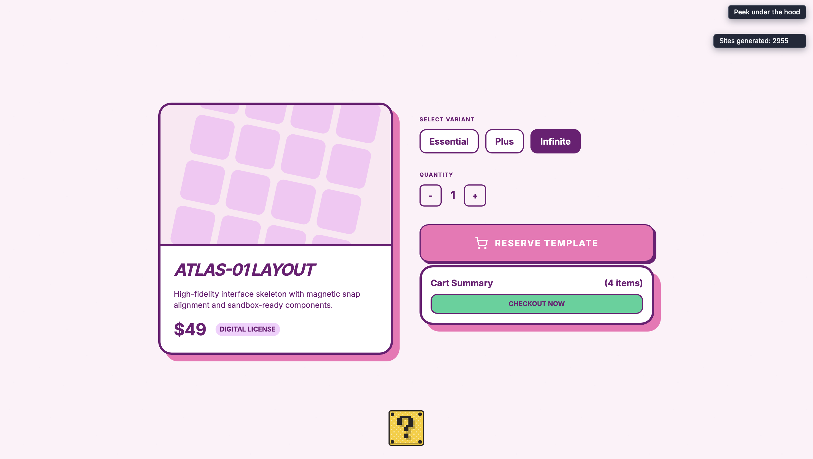
   <br/>
   <em>Generated Website</em>
  </td>
  <td width="50%" align="center">
   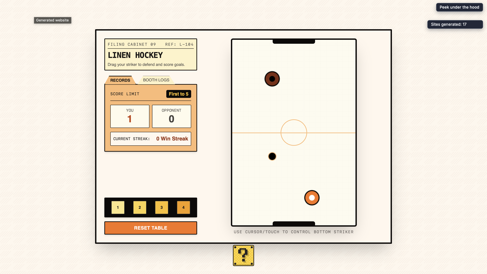
   <br/>
   <em>Generated Website</em>
  </td>
 </tr>
 <tr>
  <td width="50%" align="center">
   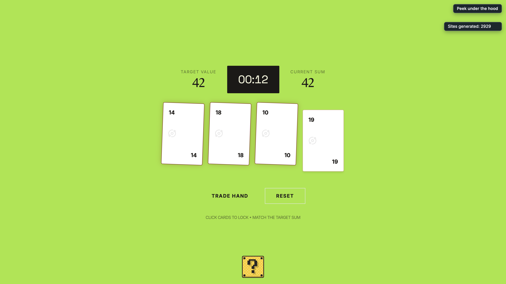
   <br/>
   <em>Generated Website</em>
  </td>
  <td width="50%" align="center">
   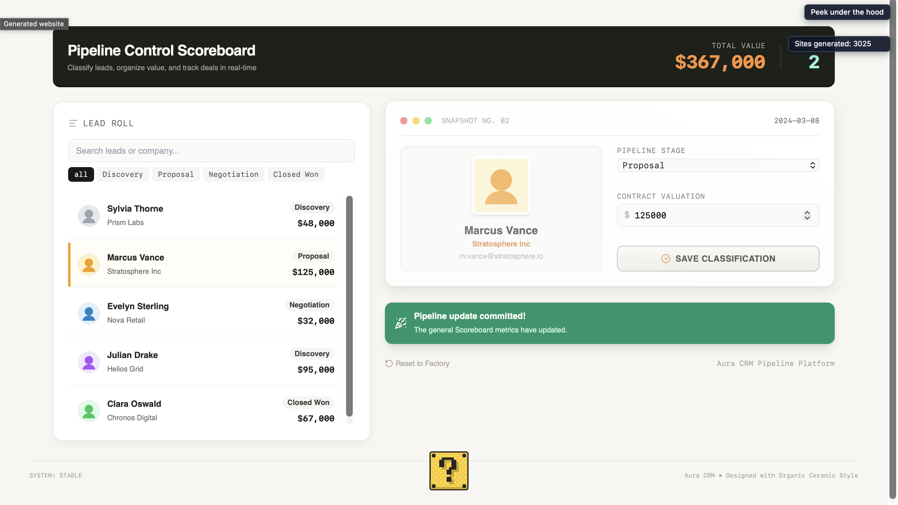
   <br/>
   <em>Generated Website</em>
  </td>
 </tr>
</table>

### v1.5 Generated Websites

<table>
 <tr>
  <td width="50%" align="center">
   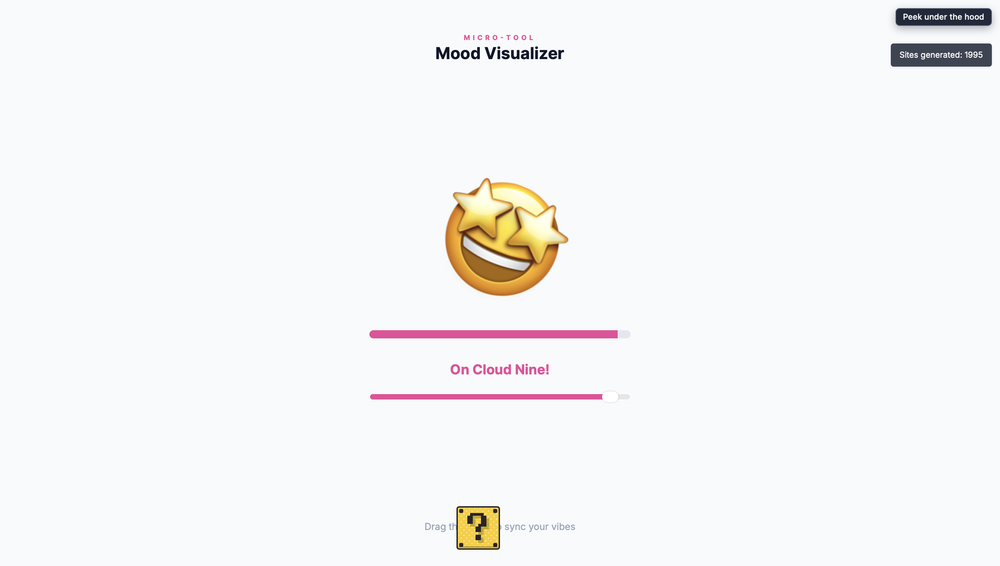
   <br/>
   <em>Generated Website</em>
  </td>
  <td width="50%" align="center">
   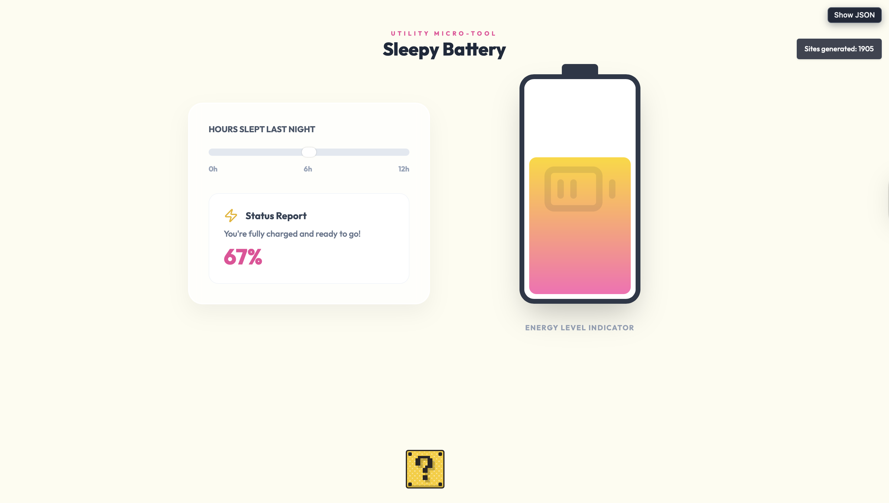
   <br/>
   <em>Generated Website</em>
  </td>
 </tr>
 <tr>
  <td width="50%" align="center">
   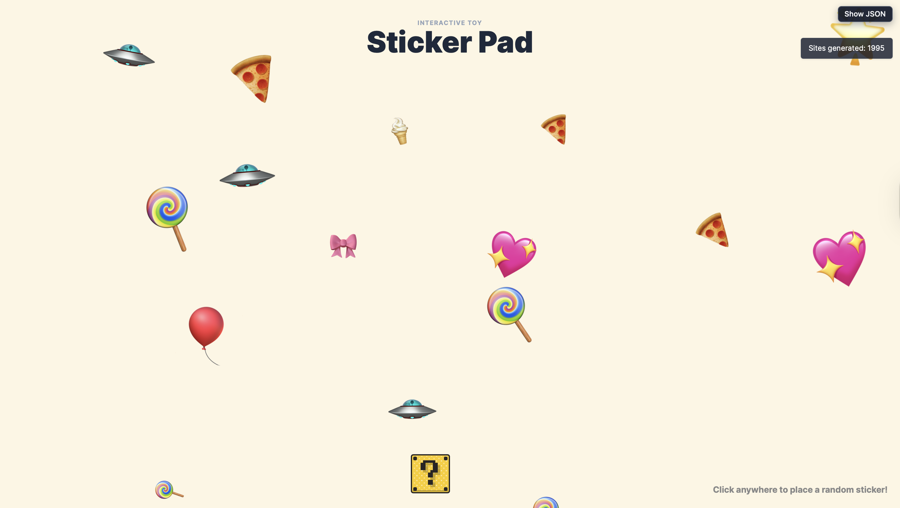
   <br/>
   <em>Generated Website</em>
  </td>
  <td width="50%" align="center">
   
   <br/>
   <em>Generated Website</em>
  </td>
 </tr>
</table>

### v1 Generated Websites

<table>
 <tr>
  <td width="50%" align="center">
   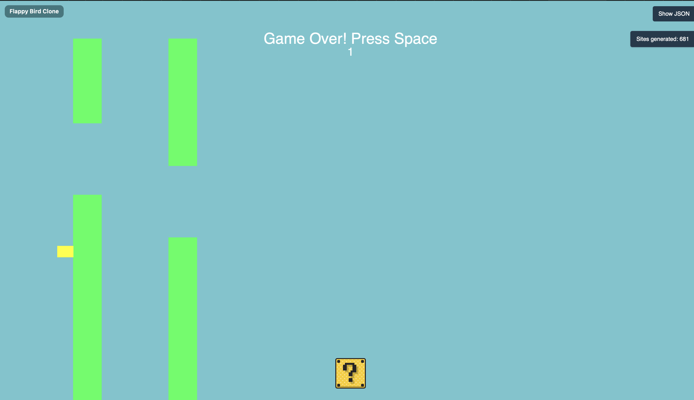
   <br/>
   <em>Generated Website</em>
  </td>
  <td width="50%" align="center">
   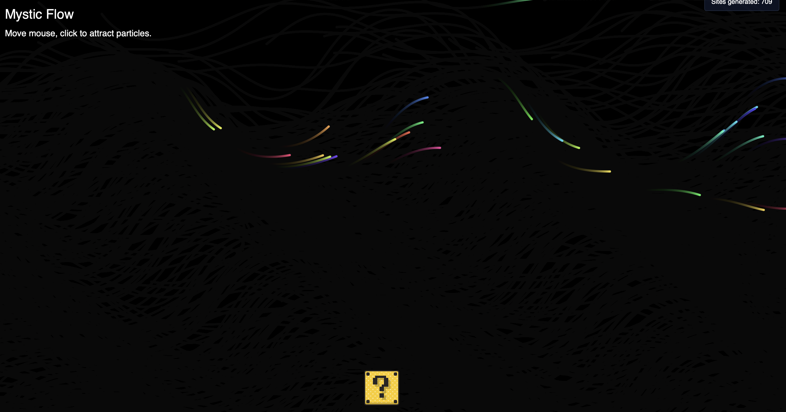
   <br/>
   <em>Generated Website</em>
  </td>
 </tr>
 <tr>
  <td width="50%" align="center">
   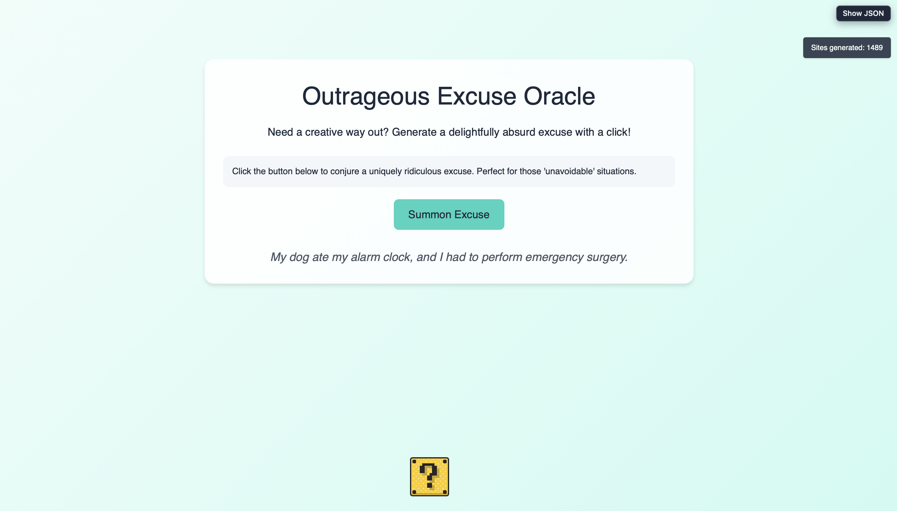
   <br/>
   <em>Generated Website</em>
  </td>
  <td width="50%" align="center">
   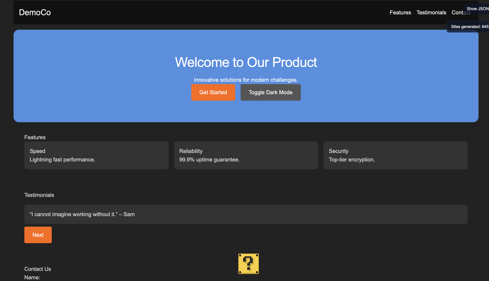
   <br/>
   <em>Generated Website</em>
  </td>
 </tr>
</table>

</div>

## How It Works

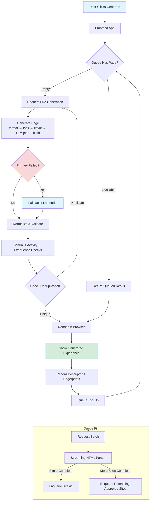
```mermaid
graph TD
    A[User Clicks Generate] --> B[Frontend App]
    B --> C{Queue Has Page?}
    C -->|Available| D[Return Queued Result]
    C -->|Empty| E[Request Live Generation]
    E --> F[Generate Page<br/>format → task → flavor → LLM plan + build]
    F --> H{Primary Failed?}
    H -->|No| I[Normalize & Validate]
    H -->|Yes| H2[Fallback LLM Model]
    H2 --> I
    I --> Q[Visual + Activity + Experience Checks]
    Q --> M{Check Deduplication}
    M -->|Unique| N[Render in Browser]
    M -->|Duplicate| E
    N --> O[Show Generated Experience]
    O --> R[Record Descriptor + Fingerprints]
    R --> P[Queue Top-Up]
    P --> C
    D --> N

    subgraph Queue Fill
    P1[Request Batch]
    P2[Streaming HTML Parser]
    P3[Enqueue Site #1]
    P4[Enqueue Remaining Approved Sites]
    P1 --> P2
    P2 -->|Site 1 Complete| P3
    P2 -->|More Sites Complete| P4
    end
    P ---> P1

    style A fill:#e1f5ff
    style O fill:#d4edda
    style H fill:#f8d7da
    style H2 fill:#e1f5ff
```

## Combinatorial Creative Entropy

Roulette's novelty system is inspired by **Shannon entropy**, the information theory concept introduced by Claude Shannon in 1948 to describe uncertainty and surprise in a message.

Roulette applies that idea to creative generation, but the randomness is not flat. Each generation starts from a recognizable format such as a game, quiz, editor, booking flow, planner, dashboard, simulator, or mini app. Then the system gives that format a task model: user goal, domain objects, state variables, controls, and a completion condition. Only after that does the LLM receive the stranger creative flavor: semantic anchors, palette, motion language, typography, texture, rendering mode, and tone.

The semantic-anchor layer alone creates **759,375** combinations. Across all current creative buckets, Roulette has over **1,400 quadrillion** possible generation targets. This is **combinatorial creative entropy**: novelty created through structured combinations, while the task model keeps the result recognizable instead of incoherent.

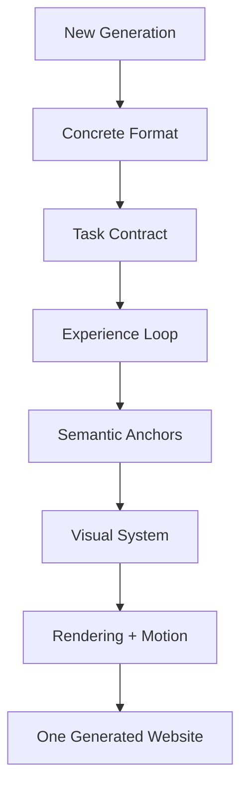
```mermaid
flowchart TD
 G["New Generation"] --> A["Concrete Format"]
 A --> B["Task Contract"]
 B --> C["Experience Loop"]
 C --> D["Semantic Anchors"]
 D --> E["Visual System"]
 E --> F["Rendering + Motion"]
 F --> H["One Generated Website"]
```

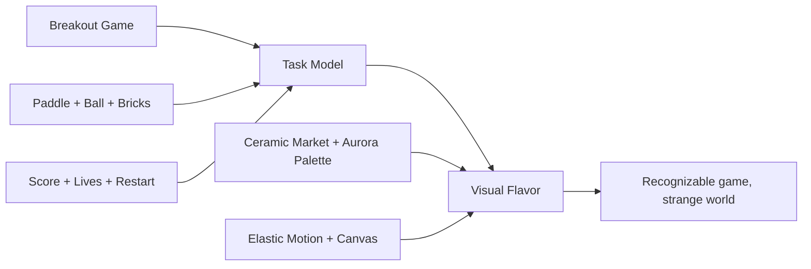
```mermaid
flowchart LR
 A["Breakout Game"] --> Z["Task Model"]
 B["Paddle + Ball + Bricks"] --> Z
 C["Score + Lives + Restart"] --> Z
 Z --> V["Visual Flavor"]
 D["Ceramic Market + Aurora Palette"] --> V
 E["Elastic Motion + Canvas"] --> V
 V --> W["Recognizable game, strange world"]
```

### Architecture Components

| Component             | Location                     | Purpose                                            |
| ---------------------------------- | ------------------------------------------------- | ---------------------------------------------------------------------------------------------- |
| **Frontend UI**          | `templates/index.html`<br/>`static/ts-src/app.ts`<br/>`static/ts-src/frame_renderer.ts` | Landing tunnel, generation controls, and iframe sandbox renderer       |
| **NDW Runtime**          | `static/ts-src/ndw.ts`              | Custom JavaScript runtime for games: `loop(dt)`, input handling, canvas helpers, RNG      |
| **API Backend**          | `api/main.py`                   | FastAPI server exposing `/generate`, `/metrics`, `/prefetch` endpoints             |
| **LLM Client**           | `api/llm_client.py`                | LLM planner, one-shot self-correcting raw-HTML build, fallback routing, and burst parsing |
| **Prefetch Engine**        | `api/prefetch.py`                 | Shared queue, preview tokens, Redis/file storage, and lane isolation.         |
| **Deduplication**         | `api/dedupe.py`                  | Content fingerprinting to prevent near-identical outputs                    |
| **Generation Grammar**       | `api/generation/`                | Task contracts, experience grammar, semantic anchors, prompt contracts, Redis diversity steering, and activity/experience scoring |
| **Validators / Quality**      | `api/preflight.py`<br/>`api/quality.py`     | Local asset/runtime preflight and visual scoring                  |
| **Node.js Tooling**        | `package.json`, `static/ts-src/`         | Tailwind + TypeScript build pipeline for frontend assets                    |

## Quick Start

### Prerequisites

- Python 3.9+
- Node.js 16+
- An LLM API key for normal generation

### Installation

1. **Clone the repository**

  ```bash
  git clone https://github.com/lesprgm/Roulette.git
  cd Roulette
  ```

2. **Set up Python environment**

  ```bash
  python3 -m venv venv
  source venv/bin/activate # On Windows: venv\Scripts\activate
  pip install -r requirements.txt
  ```

3. **Install Node dependencies**

  ```bash
  npm install
  ```

4. **Configure API keys**

  Create a `.env` file in the project root:

  ```bash
  GEMINI_API_KEY=your_gemini_api_key_here
  ```

5. **Build frontend assets**

  ```bash
  npm run build
  ```

6. **Start the server**

  ```bash
  uvicorn api.main:app --reload
  ```

7. **Open your browser**

  Navigate to `http://localhost:8000` and click a preview or generate a new world.

### Development Mode

For active development with auto-reloading:

```bash
# Terminal 1: Watch and rebuild TypeScript + CSS
npm run watch

# Terminal 2: Run FastAPI with hot reload
uvicorn api.main:app --reload
```

## How to Use

1. **Visit the landing page** at `http://localhost:8000`
2. **Click a tunnel preview** to enter a queued random world instantly
3. **Use Generate** inside the runtime to jump to another world

### API Endpoints

| Endpoint      | Method | Description                   |
| ------------------ | ------ | ------------------------------------------------ |
| `/`        | GET  | Landing page with roulette tunnel previews    |
| `/generate`    | POST  | Serve or generate a new experience    |
| `/generate/stream` | POST  | Streaming generation with progress updates    |
| `/metrics/total`  | GET  | Count of sites actually served to users     |
| `/prefetch/status` | GET  | Check queue status and refill settings      |
| `/api/premium/previews` | GET | Admin/dev inspection of the shared queue |
| `/prefetch/fill`  | POST  | Manually refill prefetch queue          |
| `/llm/status`   | GET  | LLM provider configuration and status      |
| `/llm/probe`    | GET  | Test LLM provider connectivity          |

## Configuration

Configure behavior via environment variables:

### LLM Provider Settings

| Variable           | Description              | Default                   |
| ----------------------------- | ------------------------------------- | ------------------------------------------- |
| `GEMINI_GENERATION_MODEL`   | Primary Gemini generation model    | `gemini-3.5-flash`             |
| `GEMINI_FALLBACK_MODEL`    | Gemini fallback generation model   | `gemini-3-flash-preview`          |
| `GEMINI_THINKING_LEVEL`    | Gemini thinking budget        | `medium`                  |
| `GEMINI_MAX_OUTPUT_TOKENS`  | Gemini generation output cap     | `64000`                   |
| `GEMINI_PREMIUM_BUILD_MAX_OUTPUT_TOKENS` | Build/burst output cap | `64000` |
| `GEMINI_API_KEY`       | Google AI Studio API key       | required for live generation        |
| `LLM_TIMEOUT_SECS`      | Request timeout in seconds      | `105`                    |

The live provider is configured through these env vars. Queueing and local gates are the reliability layer; legacy secondary provider routing has been removed from the active architecture.

### Queue & Caching

| Variable         | Description                 | Default         |
| ------------------------ | ------------------------------------------- | ----------------------- |
| `DEDUPE_ENABLED`     | Enable duplicate detection         | `true`         |
| `DEDUPE_RECENT_FILE`   | Deduplication database file         | `cache/seen_pages.json` |
| `PREMIUM_QUEUE_ENABLED` | Enable the shared queue lane | `true` |
| `PREMIUM_FILL_TO` | Target queue size after refill | `10` |
| `PREMIUM_LOW_WATER` | Trigger top-up when queue drops | `3` |
| `PREMIUM_BATCH_SIZE` | Number of candidates per live/top-up burst | `12` |
| `PREMIUM_BURST_MIN_HTML_BYTES` | Reject tiny/minimal burst candidates before serving or queueing | `3000` |
| `PREFLIGHT_HTML_WARN_BYTES` | Warn on unusually large generated pages | `180000` |
| `PREFLIGHT_HTML_BLOCK_BYTES` | Block extreme generated pages before serving or queueing | `280000` |
| `PREMIUM_TOKEN_TTL_SECONDS` | Preview token lifetime | `900` |
| `PREMIUM_TOPUP_ENABLED` | Allow background queue refill | `false` |
| `STREAM_KEEPALIVE_SECONDS` | Keepalive ping interval while stream generation waits for the first page | `8` |
| `PREFETCH_PREWARM_COUNT` | Number of docs to generate before startup  | `0`           |
| `REDIS_DIVERSITY_ENABLED` | Store served-site descriptors and QD counters in Redis when `REDIS_URL` exists | `true` |
| `REDIS_COUNTER_KEY` | Durable Redis key used by the public served-site counter | `ndw:metrics:total` |
| `REDIS_COUNTER_TIMEOUT` | Redis counter connection/read timeout in seconds | `2.0` |
| `COUNTER_BASELINE` | Optional one-time migration floor for an empty replacement database | `0` |
| `VARIANT_CATALOG_PATH` | Combined private YAML generation catalog supplied as a Render Secret File | `/etc/secrets/variant_catalog.yaml` |
| `DIVERSITY_HTML_CACHE_TTL_SECONDS` | Optional TTL for cached generated HTML descriptors | `604800` |
| `DIVERSITY_FINGERPRINT_TTL_SECONDS` | Short-term descriptor/structure fingerprint TTL | `604800` |

The public product uses the shared queue. Background jobs may enqueue docs, but the
public `Sites generated` metric only increments when a user is actually served a site.
When the queue is empty, the backend starts one live streaming burst,
serves the first locally valid page, and drains later valid pages from that same stream
into the queue. Failed candidates and unattempted burst slots are discarded; the next
queue miss naturally starts a new burst. By default, startup/top-up refill is disabled to
avoid burning provider request quota in the background.

Legacy/admin prefill tooling still has `PREFETCH_*` knobs in code because the route names and
storage module predate the only product path. Those knobs are not a separate public mode.

The catalog loader and schema stay versioned in Python. The proprietary YAML weights and
variants are intentionally gitignored; production reads the combined catalog from the Render
Secret File `variant_catalog.yaml`, while local development can use split files under `data/`.

### Other Settings

| Variable          | Description               | Default |
| -------------------------- | ---------------------------------------- | ------- |
| `ALLOW_OFFLINE_GENERATION` | Use stub generation (no LLM) for testing | `false` |
| `ALLOW_ORIGINS`      | CORS allowed origins (comma-separated)  | `*`   |

## Testing

Run the full test suite:

```bash
pytest
```

Run specific test categories:

```bash
# Test LLM generation and prompt engineering
pytest tests/generation/test_llm_generation.py

# Test frontend rendering
pytest tests/quality/test_snippet_render_dom.py

# Test prefetch system
pytest tests/storage/test_prefetch.py

# Test with coverage
pytest --cov=api --cov-report=html

# Generate a manual review pack
python3 scripts/run_generation_review_pack.py \
 --benchmark benchmarks/review_pack_v1.json \
 --modes \
 --out artifacts/evals
```

The test suite includes **170+ tests** covering:

- Prompt engineering and LLM response validation
- NDW runtime behavior and safety checks
- Schema normalization and validation
- Deduplication logic
- Prefetch queue management
- API endpoint behavior
- Frontend iframe rendering (full HTML and NDW snippets)
- One-shot self-correction and local preflight validation

## Deployment

### Deploy to Render

This project includes a `render.yaml` blueprint for one-click deployment:

1. **Push to GitHub**

  ```bash
  git push origin main
  ```

2. **Create Render Service**
  - Go to [Render Dashboard](https://dashboard.render.com/)
  - Click **New > Blueprint**
  - Connect your GitHub repository
  - Render will detect `render.yaml` automatically

3. **Configure Environment Variables**

  Add `GEMINI_API_KEY` and `REDIS_URL` in the Render dashboard. Other settings can use
  the defaults in `render.yaml` unless you are intentionally changing queue or model behavior.

4. **Deploy**

  Render will automatically:
  - Install Python dependencies
  - Install Node dependencies
  - Build frontend assets with `npm run build`
  - Start the server with Uvicorn
  - Auto-deploy on future pushes

### Manual Deployment

For other platforms (Heroku, Railway, Fly.io, etc.):

1. **Build step**:

  ```bash
  pip install -r requirements.txt
  npm install
  npm run build
  ```

2. **Start command**:
  ```bash
  uvicorn api.main:app --host 0.0.0.0 --port $PORT
  ```

## Project Goals & Design Principles

### Why "Non-Deterministic"?

Traditional websites show the same content every time. This project explores the opposite: **what if every visit generated something new?** By leveraging AI, we create:

- **Infinite variety** - No two generations are identical
- **Shared randomness** - The app is roulette-first; it does not ask users to prompt a site into existence
- **Primary LLM queue** - planner/builder generation is the default user-facing path
- **Interactive-first** - generated worlds are coherent mini-experiences, not static landing pages
- **Creative surprise** - Unexpected combinations and themes
- **Instant gratification** - Prefetching makes it feel instantaneous

### Key Technical Decisions

1. **Two Rendering Modes**
  - **Full HTML pages**: Complete standalone experiences
  - **NDW snippets**: Lightweight canvas-based games/visuals using our custom runtime

2. **queue**
  - The app serves from a shared queue first
  - If the queue is empty, one LLM streaming burst serves the first valid page and queues later valid pages
  - Background refill is disabled by default to avoid silently burning provider quota

3. **Deduplication System**
  - Content fingerprinting prevents boring repetition
  - Recent generations are tracked and rejected if too similar
  - Ensures fresh, varied outputs

4. **Prompt Engineering**
  - Planner prompts start from a concrete format and task contract before style decisions
  - Semantic anchors are translated into visual, interaction, content, and motion roles
  - Builder prompts receive stable runtime rules, local design-kit keys, and novelty guidance
  - Runtime constraints keep outputs renderable inside the NDW host
  - Emergency fallback providers stay available only when primary generation fails

5. **Quality Guardrails**
  - Raw HTML extraction avoids JSON escaping failures
  - One-shot self-review plus local preflight checks for safety and reliability
  - Experience scoring checks visible first action, meaningful state change, feedback clarity, mobile support, and decorative-only interaction risk
  - Runtime safety checks (canvas creation, error overlays)
  - Comprehensive test coverage

## Development

### Project Structure

```
Roulette/
├── api/          # FastAPI backend
│  ├── main.py      # API routes and server
│  ├── llm_client.py   # LLM planner/builder + burst parser
│  ├── prefetch.py    # Shared queue storage lanes
│  ├── novelty.py     # Served-site novelty ledger
│  ├── dedupe.py     # Duplicate detection
│  └── validators.py   # Schema validation
├── static/
│  ├── ts-src/      # TypeScript source
│  │  ├── app.ts     # Main frontend logic
│  │  └── ndw.ts     # NDW runtime
│  └── ts-build/     # Compiled JavaScript
├── templates/
│  └── index.html     # Landing page
├── tests/         # Test suite
├── screenshots/      # Demo images by version
│  ├── v1.5/       # Latest screenshots
│  └── v1/        # Original release screenshots
└── package.json      # Node dependencies
```

### Code Style

This project uses:

- **Python**: Black formatting, type hints preferred
- **TypeScript**: ESLint + Prettier
- **Tests**: pytest with extensive coverage

Format code before committing:

```bash
# Format Python
black api/ tests/

# Format TypeScript
npm run format

# Lint TypeScript
npm run lint
```

### Node.js Build Pipeline

Node.js powers the asset build workflow. The scripts in `package.json` run Tailwind’s CLI
(`npm run build:css`) and the TypeScript compiler (`npm run build:ts`) to produce
`static/tailwind.css` and the ES modules in `static/ts-build/`. During development you can
run `npm run watch` to keep both pipelines hot. Once those assets exist, the FastAPI server
serves them directly—no Node.js runtime is required in production.

## Additional Resources

- [docs/PREMIUM_QUEUE.md](docs/PREMIUM_QUEUE.md) - Queue architecture, queue storage, serving policy, refill behavior, and counter semantics
- [docs/LLM_ORCHESTRATION.md](docs/LLM_ORCHESTRATION.md) - Primary LLM generation routing and planner/builder flow
- [docs/EXPERIENCE_GRAMMAR.md](docs/EXPERIENCE_GRAMMAR.md) - Visitor roles, primary loops, semantic translation, and experience-quality scoring
- [docs/REDIS_DIVERSITY_TRACKING.md](docs/REDIS_DIVERSITY_TRACKING.md) - Redis descriptor archive, QD counters, fingerprints, and event stream

- **FastAPI Documentation**: https://fastapi.tiangolo.com/
- **Mermaid Diagrams**: https://mermaid.js.org/

## Contributing

Contributions welcome! Areas for improvement:

- New prompt engineering techniques
- Additional validation logic
- NDW runtime features (WebGL, audio, etc.)
- Metrics dashboard
- Visual diff testing for generated pages
- Better queue moderation/inspection UI

## License

MIT License - see [LICENSE](LICENSE) file for details.

---

**Built with by Leslie** | [Report Issues](https://github.com/lesprgm/Roulette/issues) | [View Source](https://github.com/lesprgm/Roulette)
