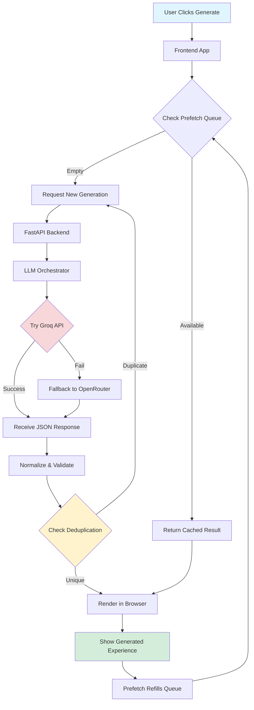

# Non-Deterministic Website

> **Generate a brand-new interactive experience with every click.** This project uses AI to create unique, interactive web pages and games on demand—no two generations are ever the same.

## 🎨 What Is This?

Non-Deterministic Website is an experimental platform that leverages large language models (LLMs) to generate interactive web experiences in real-time. Each generation produces something unique:

- 🎮 **Interactive games** with canvas animations, player controls, and game loops
- 🌐 **Complete web pages** with layouts, styling, and interactive elements  
- 🎭 **Dynamic content** that adapts to user prompts or generates creative themes automatically

The system ensures variety through intelligent deduplication, category rotation, and prompt engineering—so you'll never see the same experience twice.

## 📸 Screenshots

### Landing Page


### Generated Experience


## ⚡ How It Works



### Architecture Components

| Component | Location | Purpose |
|-----------|----------|---------|
| **Frontend UI** | `templates/index.html`<br/>`static/ts-src/app.ts` | Landing page, generation controls, rendering engine |
| **NDW Runtime** | `static/ts-src/ndw.ts` | Custom JavaScript runtime for games: `loop(dt)`, input handling, canvas helpers, RNG |
| **API Backend** | `api/main.py` | FastAPI server exposing `/generate`, `/metrics`, `/prefetch` endpoints |
| **LLM Client** | `api/llm_client.py` | Orchestrates Groq/OpenRouter APIs with retries, fallbacks, prompt engineering |
| **Prefetch Engine** | `api/prefetch.py` | Background queue that pre-generates experiences for instant delivery |
| **Deduplication** | `api/dedupe.py` | Content fingerprinting to prevent near-identical outputs |
| **Validators** | `api/validators.py` | JSON schema validation and normalization |

## 🚀 Quick Start

### Prerequisites
- Python 3.9+
- Node.js 16+
- API keys for [Groq](https://groq.com) and/or [OpenRouter](https://openrouter.ai)

### Installation

1. **Clone the repository**
   ```bash
   git clone https://github.com/lesprgm/non-deterministic-website.git
   cd non-deterministic-website
   ```

2. **Set up Python environment**
   ```bash
   python3 -m venv venv
   source venv/bin/activate  # On Windows: venv\Scripts\activate
   pip install -r requirements.txt
   ```

3. **Install Node dependencies**
   ```bash
   npm install
   ```

4. **Configure API keys**
   
   Create a `.env` file in the project root:
   ```bash
   GROQ_API_KEY=your_groq_api_key_here
   OPENROUTER_API_KEY=your_openrouter_api_key_here
   ```

5. **Build frontend assets**
   ```bash
   npm run build
   ```

6. **Start the server**
   ```bash
   uvicorn api.main:app --reload
   ```

7. **Open your browser**
   
   Navigate to `http://localhost:8000` and click "Generate" to create your first experience!

### Development Mode

For active development with auto-reloading:

```bash
# Terminal 1: Watch and rebuild TypeScript + CSS
npm run watch

# Terminal 2: Run FastAPI with hot reload
uvicorn api.main:app --reload
```

## 🎮 How to Use

1. **Visit the landing page** at `http://localhost:8000`
2. **Click "Generate"** to create a random interactive experience
3. **Interact with the result** - click, drag, use arrow keys, etc.
4. **Generate again** to get something completely different!

### API Endpoints

| Endpoint | Method | Description |
|----------|--------|-------------|
| `/` | GET | Landing page with generation controls |
| `/generate` | POST | Generate a new experience (returns JSON or HTML) |
| `/generate/stream` | POST | Streaming generation with progress updates |
| `/metrics/total` | GET | Count of total generated experiences |
| `/prefetch/status` | GET | Check prefetch queue status |
| `/prefetch/fill` | POST | Manually refill prefetch queue |
| `/llm/status` | GET | LLM provider configuration and status |
| `/llm/probe` | GET | Test LLM provider connectivity |

## 🔧 Configuration

Configure behavior via environment variables:

### LLM Provider Settings

| Variable | Description | Default |
|----------|-------------|---------|
| `GROQ_API_KEY` | Groq API authentication key | (required) |
| `GROQ_MODEL` | Primary Groq model | `llama-3.3-70b-versatile` |
| `GROQ_FALLBACK_MODEL` | Backup model if primary fails | `openai/gpt-oss-120b` |
| `GROQ_MAX_TOKENS` | Max output tokens for Groq | `15000` |
| `OPENROUTER_API_KEY` | OpenRouter API key (fallback) | (optional) |
| `OPENROUTER_MODEL` | OpenRouter model to use | `google/gemini-2.0-flash-exp:free` |
| `FORCE_OPENROUTER_ONLY` | Use only OpenRouter, skip Groq | `false` |
| `LLM_TIMEOUT_SECS` | Request timeout in seconds | `75` |

### Prefetch & Caching

| Variable | Description | Default |
|----------|-------------|---------|
| `PREFETCH_ENABLED` | Enable background prefetch | `true` |
| `PREFETCH_DIR` | Directory for cached generations | `cache/prefetch` |
| `PREFETCH_LOW_WATER` | Queue size to trigger refill | `3` |
| `PREFETCH_FILL_TO` | Target queue size after refill | `5` |
| `DEDUPE_ENABLED` | Enable duplicate detection | `true` |
| `DEDUPE_RECENT_FILE` | Deduplication database file | `cache/seen_pages.json` |

### Other Settings

| Variable | Description | Default |
|----------|-------------|---------|
| `ALLOW_OFFLINE_GENERATION` | Use stub generation (no LLM) for testing | `false` |
| `ALLOW_ORIGINS` | CORS allowed origins (comma-separated) | `*` |

## 🧪 Testing

Run the full test suite:

```bash
pytest
```

Run specific test categories:

```bash
# Test LLM generation and prompt engineering
pytest tests/test_llm_generation.py

# Test frontend rendering
pytest tests/test_snippet_render_dom.py

# Test prefetch system
pytest tests/test_prefetch.py

# Test with coverage
pytest --cov=api --cov-report=html
```

The test suite includes **70+ tests** covering:
- ✅ Prompt engineering and LLM response validation
- ✅ NDW runtime behavior and safety checks
- ✅ Schema normalization and validation
- ✅ Deduplication logic
- ✅ Prefetch queue management
- ✅ API endpoint behavior
- ✅ Frontend rendering (full HTML and NDW snippets)

## 📦 Deployment

### Deploy to Render

This project includes a `render.yaml` blueprint for one-click deployment:

1. **Push to GitHub**
   ```bash
   git push origin main
   ```

2. **Create Render Service**
   - Go to [Render Dashboard](https://dashboard.render.com/)
   - Click **New > Blueprint**
   - Connect your GitHub repository
   - Render will detect `render.yaml` automatically

3. **Configure Environment Variables**
   
   Add these in the Render dashboard under "Environment":
   - `GROQ_API_KEY`
   - `OPENROUTER_API_KEY` (optional)
   - Any other custom settings from the Configuration section

4. **Deploy**
   
   Render will automatically:
   - Install Python dependencies
   - Install Node dependencies  
   - Build frontend assets with `npm run build`
   - Start the server with Uvicorn
   - Auto-deploy on future pushes

### Manual Deployment

For other platforms (Heroku, Railway, Fly.io, etc.):

1. **Build step**:
   ```bash
   pip install -r requirements.txt
   npm install
   npm run build
   ```

2. **Start command**:
   ```bash
   uvicorn api.main:app --host 0.0.0.0 --port $PORT
   ```

## 🎯 Project Goals & Design Principles

### Why "Non-Deterministic"?

Traditional websites show the same content every time. This project explores the opposite: **what if every visit generated something new?** By leveraging AI, we create:

- **Infinite variety** - No two generations are identical
- **Creative surprise** - Unexpected combinations and themes
- **Interactive experiences** - Games, simulations, and dynamic content
- **Instant gratification** - Prefetching makes it feel instantaneous

### Key Technical Decisions

1. **Two Rendering Modes**
   - **Full HTML pages**: Complete standalone experiences
   - **NDW snippets**: Lightweight canvas-based games/visuals using our custom runtime

2. **Smart Prefetching**
   - Background generation keeps a queue ready
   - Users get instant results without waiting for LLM latency
   - Queue automatically refills in the background

3. **Deduplication System**
   - Content fingerprinting prevents boring repetition
   - Recent generations are tracked and rejected if too similar
   - Ensures fresh, varied outputs

4. **Prompt Engineering**
   - Category rotation prevents repetitive themes
   - Strict JSON schema ensures parseable outputs
   - Runtime constraints (use `dt` for timing, proper game loop structure)
   - Automatic retry with fallback providers

5. **Quality Guardrails**
   - Schema validation catches malformed responses
   - Runtime safety checks (canvas creation, error overlays)
   - Comprehensive test coverage

## 🛠️ Development

### Project Structure

```
non-deterministic-website/
├── api/                    # FastAPI backend
│   ├── main.py            # API routes and server
│   ├── llm_client.py      # LLM orchestration
│   ├── prefetch.py        # Background queue
│   ├── dedupe.py          # Duplicate detection
│   └── validators.py      # Schema validation
├── static/
│   ├── ts-src/            # TypeScript source
│   │   ├── app.ts         # Main frontend logic
│   │   └── ndw.ts         # NDW runtime
│   └── ts-build/          # Compiled JavaScript
├── templates/
│   └── index.html         # Landing page
├── tests/                 # Test suite
├── screenshots/           # Demo images
└── package.json           # Node dependencies
```

### Code Style

This project uses:
- **Python**: Black formatting, type hints preferred
- **TypeScript**: ESLint + Prettier
- **Tests**: pytest with extensive coverage

Format code before committing:

```bash
# Format Python
black api/ tests/

# Format TypeScript
npm run format

# Lint TypeScript
npm run lint
```

## 📚 Additional Resources

- **Groq API Docs**: https://console.groq.com/docs
- **OpenRouter API Docs**: https://openrouter.ai/docs
- **FastAPI Documentation**: https://fastapi.tiangolo.com/
- **Mermaid Diagrams**: https://mermaid.js.org/

## 🤝 Contributing

Contributions welcome! Areas for improvement:

- 🎨 New prompt engineering techniques
- 🧩 Additional validation logic
- 🎮 NDW runtime features (WebGL, audio, etc.)
- 📊 Metrics dashboard
- 🔍 Visual diff testing for generated pages

## 📄 License

MIT License - see [LICENSE](LICENSE) file for details.

---

**Built with ❤️ by Leslie** | [Report Issues](https://github.com/lesprgm/non-deterministic-website/issues) | [View Source](https://github.com/lesprgm/non-deterministic-website)
