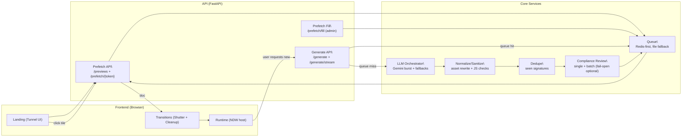

# Architecture (Hybrid Overview + Deep Dive)

This doc is intentionally a hybrid:
- **High-level:** to help a new reader understand what Roulette *is* and how data flows.
- **Deep dive:** to highlight why the system is more complex than a “simple LLM demo” (guardrails, persistence, quotas, UX transitions, and operational knobs).

Roulette has two user-facing modes:

1. **Landing (Roulette tunnel):** a 3D tunnel of preview tiles representing prefetched sites.
2. **Runtime (entered site):** renders a generated website/app inside a sandboxed container and manages lifecycle/cleanup between “worlds.”

## Main Components

- **Frontend**
  - `templates/index.html`: initial HTML shell (landing + runtime container).
  - `static/js/app.js`: main frontend controller (landing, enter, transitions/shutter, JSON overlay).
  - `static/js/ndw.js`: the NDW runtime API used by many generated pages.
  - `static/js/tunnel.js`: 3D tunnel visual.

- **API**
  - `api/main.py`: FastAPI routes (`/generate`, `/generate/stream`, `/api/prefetch/*`, `/prefetch/fill`, `/metrics/*`).
  - `api/llm_client.py`: LLM provider orchestration + burst generation + parsing + compliance calls.
  - `api/prefetch.py`: queue implementation (Redis-first, file fallback) + preview tokening.
  - `api/dedupe.py`: “seen” signatures to reduce near-duplicate outputs.
  - `api/auth.py`: API key parsing / admin bypass.
  - `api/redis_ratelimit.py`: optional Redis-backed rate limiting.
  - `api/counter.py`: usage counter (Redis-first, file fallback).

## System Layers (Why This Is More Than a Demo)

Think of Roulette as multiple planes stacked together:

1. **UX plane (what users see)**
   - Tunnel previews, click-to-enter, transitions/shutter, and consistent “generate” controls.
2. **Orchestration plane (LLM + batching)**
   - Provider ordering, burst generation, streaming parsing, salvage of partial outputs.
3. **Guardrails plane (quality/safety + runtime compatibility)**
   - Normalization, asset rewriting (avoid external CDNs), JS syntax checks, “review” step(s).
4. **Persistence plane (queues + state)**
   - Redis-first queue and “seen” memory; file fallback for local/dev.
5. **Ops plane (rate limits + knobs)**
   - App-level rate limiting, admin keys, feature flags, deploy constraints (free-tier restarts).

## System Map (Mermaid)

## Data Flow

### Landing previews

1. Browser loads `/` and JS assets.
2. Frontend polls `GET /api/prefetch/previews?limit=N`.
3. API returns preview metadata (title/category/vibe + tokenized `id`).
4. Frontend places tiles in tunnel.

### Entering a site

1. User clicks a tile.
2. Frontend fetches `GET /api/prefetch/{token}`.
3. API validates token, retrieves the doc (Redis or file), and returns it.
4. Frontend renders the doc into the runtime container and removes landing-only styling.

### Generating when queue is empty

1. Frontend calls `/generate` or `/generate/stream`.
2. API attempts to serve from queue first; if empty, it calls the LLM path.
3. First doc is returned to the user; burst followups are optionally queued (and reviewed in batches).

### What “Burst + Review + Queue” Really Means

Behind the simple “generate” action, the backend can do a multi-stage pipeline:

1. **Generate burst** (multiple pages per call) for quota efficiency.
2. **Extract usable docs** from streaming output (including salvage if truncated).
3. **Normalize/sanitize** docs so they render in the host runtime (and don’t rely on external CDNs).
4. **Dedupe** to avoid near-identical pages.
5. **Review** followups in batches (fail-open configurable) so the first page isn’t blocked by reviewer flakiness.
6. **Enqueue** remaining docs for future instant delivery.

## Why These Design Choices

- **Prefetch queue:** makes the UX “instant” most of the time and amortizes LLM cost across users.
- **Burst generation:** maximizes throughput per provider quota by generating multiple pages per call.
- **Redis-first storage:** enables persistence across restarts and avoids “free-tier wipes” (file-only queues reset).
- **Fail-open compliance (configurable):** avoids blocking user-visible generation when the reviewer is overloaded.
- **Local vendor scripts (tailwind-play, gsap, lucide):** reduces external dependency breakage and makes generated pages more consistent.

## Operational Reality (Render Free Tier)

On free-tier hosts, restarts can happen and file storage can be wiped. Without Redis:
- the prefetch queue drains to zero after a restart,
- “seen” memory resets (more repeats),
- counters reset.

With Redis configured (`REDIS_URL` in Render env vars), the queue and state survive restarts.
