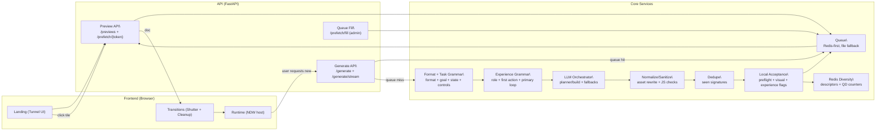
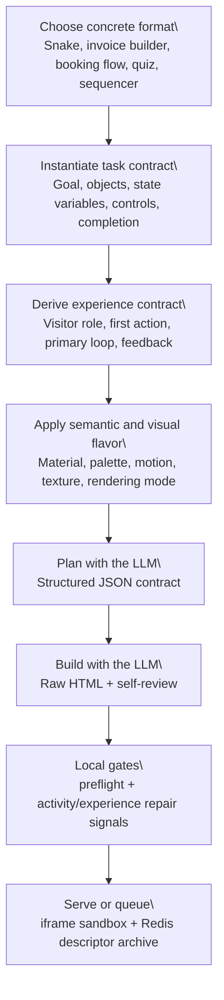

# Architecture (Hybrid Overview + Deep Dive)

This doc is intentionally a hybrid:
- **High-level:** to help a new reader understand what Roulette *is* and how data flows.
- **Deep dive:** to highlight why the system is more complex than a “simple LLM demo” (guardrails, persistence, generation routing, UX transitions, and operational knobs).

Roulette is a generative UI system for one-off interactive web experiences. The stable product is the host runtime; the generated product is the interface shown inside it.

Roulette has two user-facing states:

1. **Landing (Roulette tunnel):** a 3D tunnel of preview tiles representing queued sites.
2. **Runtime (entered site):** renders a generated website/app inside a sandboxed container and manages lifecycle/cleanup between “worlds.”

## Main Components

- **Frontend**
 - `templates/index.html`: initial HTML shell (landing + runtime container).
 - `static/ts-src/app.ts`: main frontend controller (landing, enter, transitions/shutter, JSON overlay).
 - `static/ts-src/frame_renderer.ts`: generated-site iframe creation, title extraction, and `postMessage` bridge injection.
 - `static/ts-src/ndw.ts`: the NDW runtime API used by many generated pages.
 - `static/ts-src/tunnel.ts`: 3D tunnel visual.
 - `static/js/*.js`: generated build output, not source.

- **API**
 - `api/main.py`: FastAPI routes (`/generate`, `/generate/stream`, `/api/prefetch/*`, `/api/premium/previews`, `/prefetch/fill`, `/metrics/*`).
 - `api/llm_client.py`: LLM planner/builder orchestration, raw-HTML extraction, and fallback routing.
 - `api/generation/experience_grammar.py`: concrete activity formats, interaction archetypes, primary loop types, feedback patterns, and failure modes.
 - `api/generation/task_grammar.py`: task-model contracts for each concrete format: user goal, objects, state, controls, completion, and allowed UI patterns.
 - `api/generation/experience_quality.py`: deterministic checks for visible first action, state change, feedback, replay, and mobile fallback.
 - `api/generation/activity_quality.py`: deterministic activity-depth and task-contract checks for games, apps, tools, quizzes, and simulations.
 - `api/generation/prompts.py`: shared prompt contracts and planner response schema.
 - `api/generation/redis_diversity.py`: Redis descriptor archive, quality-diversity counters, fingerprints, and event logging.
 - `api/prefetch.py`: shared queue implementation (Redis-first, file fallback) + preview tokening.
 - `api/dedupe.py`: “seen” signatures to reduce near-duplicate outputs.
 - `api/auth.py`: API key parsing / admin bypass.
 - `api/redis_ratelimit.py`: optional Redis-backed rate limiting.
 - `api/counter.py`: usage counter (Redis-first, file fallback).

## System Layers (Why This Is More Than a Demo)

Think of Roulette as multiple planes stacked together:

1. **UX plane (what users see)**
  - Tunnel previews, click-to-enter, transitions/shutter, and consistent “generate” controls.
2. **Orchestration plane (LLM + queue refill)**
  - Planner/build generation, queue-first serving, and optional queue refill.
3. **Guardrails plane (quality/safety + runtime compatibility)**
  - Normalization, asset rewriting (avoid external CDNs), JS syntax checks, preflight, visual scoring, and experience scoring.
4. **Persistence plane (queues + state)**
 - Redis-first queue, compact descriptors, quality-diversity counters, event logs, fingerprints, and file fallback for local/dev.
5. **Ops plane (rate limits + knobs)**
  - App-level rate limiting, admin keys, feature flags, deploy constraints (free-tier restarts).

## System Map (Mermaid)

```mermaid
flowchart LR
 subgraph Frontend["Frontend (Browser)"]
  L["Landing (Tunnel UI)"]
  R["Runtime (NDW host)"]
  T["Transitions (Shutter + Cleanup)"]
 end

 subgraph API["API (FastAPI)"]
  P["Preview API\\n/previews + /prefetch/{token}"]
  G["Generate API\\n/generate + /generate/stream"]
  F["Queue Fill\\n/prefetch/fill (admin)"]
 end

 subgraph Core["Core Services"]
  Q["Queue\\nRedis-first, file fallback"]
  D["Dedupe\\nseen signatures"]
  N["Normalize/Sanitize\\nasset rewrite + JS checks"]
  C["Local Acceptance\\npreflight + visual + experience flags"]
  X["Format + Task Grammar\\nformat + goal + state + controls"]
  E["Experience Grammar\\nrole + first action + primary loop"]
  A["Redis Diversity\\ndescriptors + QD counters"]
  O["LLM Orchestrator\\nplanner/build + fallbacks"]
 end

 L --> P
 P --> Q
 L -->|click tile| P
 P -->|doc| T --> R

 R -->|user requests new| G
 F --> Q
 G -->|queue hit| Q --> P
 G -->|queue miss| X --> E --> O --> N --> D --> C --> Q
 C --> A
```

## Generation Order

The generator is intentionally format-first. Randomness is still present, but it is not allowed to overpower the core product shape.

```mermaid
flowchart TD
 A["Choose concrete format\\nSnake, invoice builder, booking flow, quiz, sequencer"]
 B["Instantiate task contract\\nGoal, objects, state variables, controls, completion"]
 C["Derive experience contract\\nVisitor role, first action, primary loop, feedback"]
 D["Apply semantic and visual flavor\\nMaterial, palette, motion, texture, rendering mode"]
 E["Plan with the LLM\\nStructured JSON contract"]
 F["Build with the LLM\\nRaw HTML + self-review"]
 G["Local gates\\npreflight + activity/experience repair signals"]
 H["Serve or queue\\niframe sandbox + Redis descriptor archive"]

 A --> B --> C --> D --> E --> F --> G --> H
```

This order matters. A Snake game can be styled like a lunar warehouse or a clay arcade, but it should still visibly play like Snake. A booking flow can have strange art direction, but it still needs destinations, dates, selections, price/result state, and a completion action. Semantic anchors are flavor, not the product.

## Data Flow

### Landing previews

1. Browser loads `/` and JS assets.
2. Frontend polls `GET /api/prefetch/previews?limit=N`.
3. API returns preview metadata (title/category/vibe + tokenized `id`).
4. Frontend places tiles in tunnel.

### Entering a site

1. User clicks a tile.
2. Frontend fetches `GET /api/prefetch/{token}`.
3. API validates token, retrieves the doc (Redis or file), increments the user-facing served-sites counter, and returns it.
4. Frontend renders the doc into an iframe sandbox and removes landing-only styling.

### Generating when queue is empty

1. Frontend calls `/generate` or `/generate/stream`.
2. API attempts to serve from the shared queue first.
3. If the queue is empty, the API starts one LLM streaming burst.
4. The first locally valid doc from that stream is returned to the user.
5. Later valid docs from the same stream are drained into the queue.
6. Optional background top-up can refill the queue later.

### generation

1. Frontend has no quality switch; All user-facing generations use this path.
2. API tries the shared queue first.
3. If empty, API runs one live LLM streaming burst.
4. Live serving returns the first doc that passes local preflight plus the fail-open gate.
5. Remaining valid docs from the same stream are queued for later requests.
6. Queue/top-up candidates use the same local acceptance gate before storage.

### What “Generate + Self-Correct + Queue” Really Means

Behind the simple “generate” action, the backend can do a multi-stage pipeline:

1. **Select** a recognizable activity format first.
2. **Instantiate** the task contract: goal, domain objects, state variables, controls, completion condition, and allowed UI patterns.
3. **Plan** semantic translation, visitor role, first interaction, primary loop, and art direction with the LLM.
4. **Build** a complete renderable page with one-shot self-review and a final fenced HTML block.
5. **Normalize/sanitize** docs so they render in the host runtime and don’t rely on external CDNs.
6. **Dedupe and annotate** visual/render quality, task coherence, and experience behavior as repair signals.
7. **Record descriptors** after user-visible serving so Redis can steer future formats and experience cells without prompt bloat.

Generation has one active product path: raw-HTML sites produced by the configured LLM, accepted by local gates, then served immediately or cached in the queue.

## Why These Design Choices

- **Shared queues:** make the UX “instant” most of the time and amortize LLM cost across users.
- **Single generation lane:** keeps quality consistent instead of exposing users to mixed output tiers.
- **Format-first task grammar:** prevents abstract anchor soup by making every page start from a recognizable game, app, tool, quiz, simulator, or workflow.
- **Experience grammar:** forces pages to define what the visitor does, what changes, and why to continue.
- **Redis descriptor tracking:** reduces repeated behavioral cells without injecting prior full websites into prompts.
- **Redis-first storage:** enables persistence across restarts and avoids “free-tier wipes” (file-only queues reset).
- **Iframe sandbox rendering:** destroys the previous site iframe on each generation, isolating WebGL, timers, styles, and event listeners from the host app.
- **Local vendor scripts (tailwind-play, gsap, lucide):** reduces external dependency breakage and makes generated pages more consistent.

## Operational Reality (Render Free Tier)

On free-tier hosts, restarts can happen and file storage can be wiped. Without Redis:
- the queue drains to zero after a restart,
- “seen” memory resets (more repeats),
- counters reset.

With Redis configured (`REDIS_URL` in Render env vars), the queue and state survive restarts.
