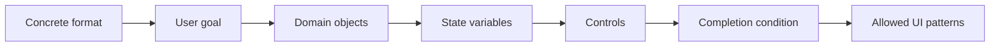
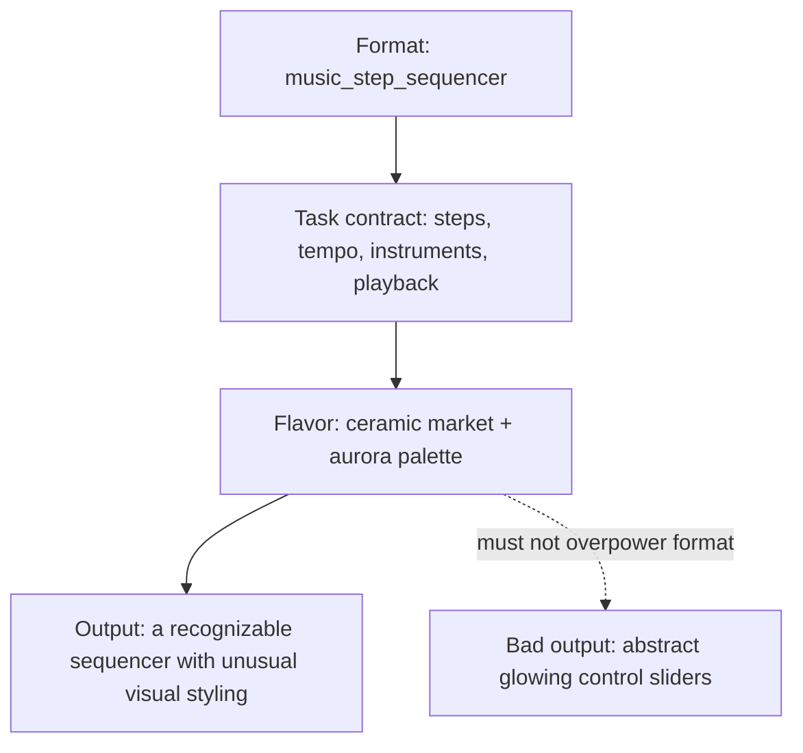

# Experience Grammar

Roulette is not prompt-to-site. It generates random interactive mini-experiences. The experience grammar is the layer that turns randomness into something a visitor can understand and play with.

## Contract

Every plan should define:

- `task_contract.format`
- `task_contract.user_goal`
- `task_contract.domain_objects`
- `task_contract.state_variables`
- `task_contract.controls`
- `task_contract.completion_condition`
- `task_contract.allowed_patterns`
- `experience_archetype`
- `primary_loop_type`
- `semantic_anchors`
- `semantic_translation`
- `visitor_role`
- `visitor_goal`
- `first_interaction`
- `activity_contract.activity_variant`
- `activity_contract.library_profile`
- `primary_loop`
- `feedback_contract`
- `progression_model`
- `reset_or_replay`
- `onboarding_cue`
- `mobile_interaction`

## Task Contract First

The task contract is the first layer of coherence. It says what the generated page actually is before any poetic theme, material, palette, or motion language is applied.

Examples:

- `snake_grid`: snake, food, grid, score, collision, restart, keyboard/touch controls.
- `invoice_builder`: client, line items, tax, subtotal, total, save/export, validation state.
- `travel_booking`: destination, dates, guests, price, selection, booking summary.
- `music_step_sequencer`: steps, tempo, instruments, pattern state, play/stop, clear/randomize.

Semantic anchors must not rename or obscure the task. A Snake game should not become “Echo Migration.” A booking flow should not become “Signal Pilgrimage.” The anchors can influence object names, surface treatment, copy tone, texture, and micro-motion, but the user must still recognize the format.

The primary loop must answer:

- What does the visitor do?
- What visibly changes?
- What state is now different?
- Why would the visitor continue?

`activity_type` is intentionally broad; `activity_variant` is the concrete product/game format. For example, `microgame` can resolve to Breakout, Minesweeper, 2048, rhythm tap, pinball, maze escape, basketball arcade, or other lightweight formats. This prevents the generator from converging on only Snake, Tic-Tac-Toe, and quiz pages.

`library_profile` tells the builder which local primitive should carry the interaction:

- `ndw_canvas_game_loop` or `ndw_audio_particles` for lightweight games and toys.
- `gsap_timeline_dom` or `gsap_state_transition` for DOM/state choreography.
- `lucide_app_chrome` for app, SaaS, commerce, and booking interfaces.
- `three_orbit_scene` or `three_bloom_scene` for one focused spatial/3D scene.

## Semantic Translation

Semantic anchors are not surface decoration. The planner must translate each anchor into:

- `visual_role`
- `interaction_role`
- `content_role`
- `motion_role`

Example: if the anchors are `concrete`, `bioluminescence`, and `typewriter`, the generated page should not merely use gray surfaces, blue glow, and monospace text. It should make typing crack a slab, reveal light, unlock message fragments, and give the visitor a reason to continue.

## Quality Checks

`api/generation/experience_quality.py` scores the plan plus generated HTML for:

- visible premise
- visible first action
- defined primary interaction
- meaningful state change
- feedback clarity
- reason to continue
- reset or replay
- orientation cues
- non-decorative interaction
- mobile interaction support
- word-salad risk

This scorer is deterministic infrastructure. It is not an LLM beauty judge and it is not meant to replace visual review. Its purpose is to emit repair signals for pages that look interactive but do not behave like an experience; it should not hard-block production serving by itself.

`api/generation/activity_quality.py` adds task-model checks:

- planned domain objects appear in the UI or script
- planned state variables are implemented
- planned controls are rendered
- controls are connected to the state they are supposed to change
- completion condition is visible or represented
- known formats are not poetically renamed beyond recognition

These are repair and diagnostic signals. Hard preflight remains reserved for unsafe, broken, non-renderable, or unusable output.

## Implementation Files

- `api/generation/experience_grammar.py`: archetypes, loop types, affordances, feedback patterns, and failure modes.
- `api/generation/task_grammar.py`: concrete format task contracts.
- `api/generation/activity_quality.py`: activity-depth checks, including selected game/app variant coverage.
- `api/generation/semantic_anchors.py`: stratified semantic anchor buckets.
- `api/generation/experience_quality.py`: deterministic experience scoring.
- `api/generation/prompts.py`: planner schema and prompt contract.
- `api/llm_client.py`: Gemini calls, raw HTML extraction, burst streaming, and fallback routing.
