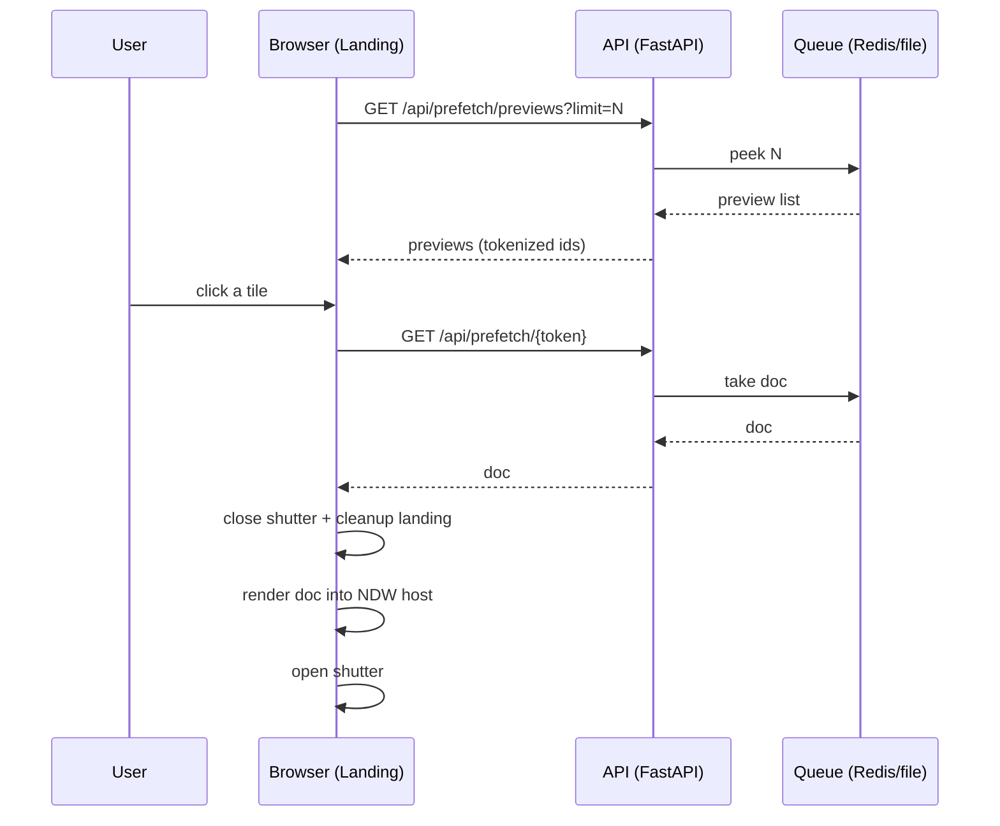

# Frontend Tunnel (Landing) - Hybrid Guide

The landing experience is a “roulette tunnel” that cycles through preview tiles representing prefetched sites.

This doc aims to be readable *and* truthful about complexity:
- a new reader should understand the UX and the API calls,
- a technical reader should understand lifecycle management and why transitions/cleanup exist.

## Core Behavior

- The tunnel is a *UI* for selecting from the prefetch queue, not the generator itself.
- The landing page is in `landing-mode`. When entering a site, the app switches to `generated-mode` and removes/turns off landing visuals.

## Where It Lives

- HTML shell: `templates/index.html` (`#tunnel-container`, `#heroHint`, `#scrollCue`, runtime containers)
- Tunnel renderer: `static/js/tunnel.js`
- Controller / glue: `static/js/app.js`
- Styles: `static/css/style.css`

## APIs Used

- `GET /api/prefetch/previews?limit=N`
  - Returns a list of preview objects: `{id, title, category, vibe, created_at, ...}`
  - `id` is a signed token (not a filename / Redis key).
- `GET /api/prefetch/{id}`
  - Validates the token and returns the actual doc.

## Full Lifecycle (What Actually Happens)

### 1) Boot

1. `templates/index.html` loads core assets (`/js/app.js`, `/js/tunnel.js`, `/js/ndw.js`).
2. The tunnel is mounted into `#tunnel-container`.
3. Landing-only visuals (noise overlay, blobs, cursor glow) are active while `landing-mode` is on.
4. Cue text (hint + scroll cue) is shown briefly to teach interaction.

### 2) Preview refresh

1. Frontend periodically calls `GET /api/prefetch/previews`.
2. Returned previews are mapped onto stable tunnel tiles.
3. If the queue is empty, the tunnel shows placeholders (tiles remain clickable depending on config/UX).

### 3) Entering a site (click a tile)

1. A click triggers a request to `GET /api/prefetch/{token}`.
2. The app begins a transition:
   - closes the shutter (visual cover),
   - clears the runtime container,
   - stops or destroys landing-specific effects (tunnel, overlays) to avoid cross-world side effects.
3. The doc is rendered into the runtime container.
4. The shutter opens and the user is “in a new world.”

### 4) Returning / generating / switching

Roulette is designed to allow repeated world transitions:
- new doc is rendered,
- previous doc is cleaned up,
- global listeners should not leak across renders.

This is why the “tunnel app” is not just a static page: it is a long-running JS controller that repeatedly mounts/unmounts dynamic apps.

## UX Decisions

- **Pinned “Roulette” title + hint cues:** keeps the “what is this?” readable while the tunnel creates motion/novelty.
- **Cue timing / dismiss on scroll:** hint and scroll cue auto-hide after a delay, or immediately after user scrolls a bit.
- **Shutter transitions:** hides “empty” intermediate states while swapping DOM and running cleanups (prevents flashes of blank/unstyled content).
- **Lifecycle cleanup:** generated pages can register loops/listeners; the host must stop them when switching pages to avoid performance degradation and weird bugs.

## Troubleshooting

- If previews appear “empty” after restarts: the queue is probably file-backed and got wiped; use Redis for persistence.
- If tiles change unexpectedly: ensure the preview list is stable and the tunnel code is mapping IDs deterministically.

## Notes on “Complexity”

The tunnel is “just UI,” but it sits on top of:
- tokenized access to prefetched docs (security),
- a queue with two backends (Redis/file),
- a rendering runtime (NDW) + safety/compat constraints,
- transitions and cleanup to support repeated world swaps.

## One Diagram (End-to-End)

