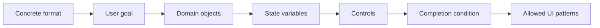
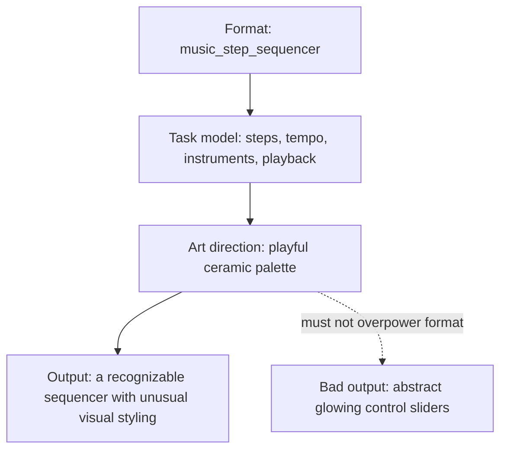

# Interaction Model

Roulette is not prompt-to-site. It generates random interactive mini-experiences. The interaction model is the layer that turns randomness into something a visitor can understand and play with.

## Model Fields

Every plan should define:

- `task_model.format`
- `task_model.user_goal`
- `task_model.domain_objects`
- `task_model.state_variables`
- `task_model.controls`
- `task_model.completion_condition`
- `task_model.allowed_patterns`
- `interaction_pattern`
- `interaction_loop`
- `visitor_role`
- `visitor_goal`
- `first_interaction`
- `format_spec.format_id`
- `format_spec.library_profile`
- `primary_loop`
- `feedback_contract`
- `progression_model`
- `reset_or_replay`
- `onboarding_cue`
- `mobile_interaction`

## Task Model First

The task model is the first layer of coherence. It says what the generated page actually is before art direction, palette, or motion language is applied.

Examples:

- `snake_grid`: snake, food, grid, score, collision, restart, keyboard/touch controls.
- `travel_booking`: destination, dates, guests, price, selection, booking summary.
- `restaurant_ordering`: menu, cart, receipt, delivery status, courier route, checkout state.
- `music_step_sequencer`: steps, tempo, instruments, pattern state, play/stop, clear/randomize.

Art direction must not rename or obscure the task. A Snake game should not become “Echo Migration.” A booking flow should not become “Signal Pilgrimage.” The user must still recognize the format.

The primary loop must answer:

- What does the visitor do?
- What visibly changes?
- What state is now different?
- Why would the visitor continue?

`format_category` is intentionally broad; `format_id` is the concrete product/game format. For example, `microgame` can resolve to Breakout, Minesweeper, 2048, rhythm tap, pinball, maze escape, basketball arcade, or other lightweight formats. This prevents the generator from converging on only Snake, Tic-Tac-Toe, and quiz pages.

`library_profile` tells the builder which local primitive should carry the interaction:

- `ndw_canvas_game_loop` or `ndw_audio_particles` for lightweight games and toys.
- `gsap_timeline_dom` or `gsap_state_transition` for DOM/state choreography.
- `lucide_app_chrome` for app, SaaS, commerce, and booking interfaces.
- `three_orbit_scene` or `three_bloom_scene` for one focused spatial/3D scene.

## Quality Checks

`api/generation/experience_quality.py` scores the plan plus generated HTML for:

- visible premise
- visible first action
- defined primary interaction
- meaningful state change
- feedback clarity
- reason to continue
- reset or replay
- orientation cues
- non-decorative interaction
- mobile interaction support
- word-salad risk

This scorer is deterministic infrastructure. It is not an LLM beauty judge and it is not meant to replace visual review. Its purpose is to emit repair signals for pages that look interactive but do not behave like an experience; it should not hard-block production serving by itself.

`api/generation/task_quality.py` adds task-model checks:

- planned domain objects appear in the UI or script
- planned state variables are implemented
- planned controls are rendered
- controls are connected to the state they are supposed to change
- completion condition is visible or represented
- known formats are not poetically renamed beyond recognition

These are repair and diagnostic signals. Hard preflight remains reserved for unsafe, broken, non-renderable, or unusable output.

## Implementation Files

- `api/generation/interaction_catalog.py`: interaction patterns, loops, affordances, feedback patterns, and failure modes.
- `api/generation/task_model.py`: concrete format task models.
- `api/generation/layout_model.py`: compositional region graphs, spatial relations, responsive transformations, and copy budgets.
- `api/generation/visual_spec.py`: task-derived visual subjects, palettes, layout models, and renderer stacks.
- `api/generation/task_quality.py`: task-quality checks, including selected game/app format coverage.
- `api/generation/experience_quality.py`: deterministic experience scoring.
- `api/generation/prompts.py`: compact creative planner schema and runtime contract.
- `api/llm_client.py`: LLM calls, raw HTML extraction, burst streaming, and fallback routing.
