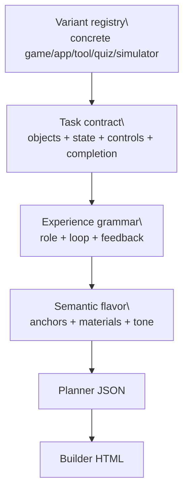

# LLM Orchestration

This system is designed to keep “novelty per dollar” high while staying robust to provider flakiness.

## Providers

Roulette has one user-facing generation path:

- **Primary LLM model**: planner + builder model for user-facing generation.
- **Fallback LLM model**: optional fallback when configured.

Exact models are configured via env vars (see `README.md`, `DEPLOYMENT_RENDER.md`, and Render env vars).

## User-Facing Generation Lane

The queue is random, queued, and art-directed:

- Prefer the shared queue.
- If the queue is empty, generate a live page through the primary LLM planner/builder path.
- Serve the first locally valid page immediately.
- Refill the queue later when top-up is explicitly enabled.
- Record a novelty fingerprint and Redis descriptor after the page is actually served.

Users do not provide prompts. The backend uses empty/random briefs and a novelty ledger to keep the roulette feeling fresh.

## Streaming Burst

On a queue miss, the backend starts one streaming request for a configured burst of pages. The current Render default is `12`.

The server behavior is:

- Parse each completed delimited site as it arrives.
- Serve the first locally valid site to the user immediately.
- Continue draining later valid sites from the same stream into the queue.
- Salvage any completed sites if the upstream stream stops early.

Each site uses the raw-HTML/self-review format and goes through local gates before it can be served or queued.

## Compatibility Burst Helpers

Older JSON burst helpers remain in the codebase for admin/backfill experiments and parser
tests, but they are not the user-facing product path.

Rationale:
- It can still produce multiple queue candidates from one request when used intentionally.
- It remains useful for legacy prefill/fill tooling and parser tests.

Tradeoffs:
- Parsing is harder (streamed arrays, partial truncations).
- Quality variance is higher than the planner/builder path.

Simple mental model:

- **Live burst:** one request asks for a configured batch of pages; first valid page goes to the user, later valid pages go to the queue.
- **Queue serve:** no model call; serve one already-generated page.
- **Compatibility burst:** one model request asks for many cheaper pages at once; this is not what normal users hit.

## Diversity Steering

Older category rotation was replaced by a format-first task model, planning axes, an experience grammar, a served-site novelty ledger, and Redis-backed quality-diversity metadata:

- concrete activity format
- task contract: goal, domain objects, state variables, controls, completion condition
- experience archetype
- primary loop type
- semantic anchors
- semantic translation
- visitor role and goal
- activity type, concrete activity variant, and library profile
- first interaction
- feedback contract
- progression/replay model
- layout archetype
- motion archetype
- visual density
- interaction model
- rendering mode
- tone
- prompt genome
- remembered fingerprint

The planner receives a positive target where `activity_variant` and `task_contract` are dominant. Semantic anchors, palette, motion, texture, rendering mode, and tone are supporting choices. Runtime rules, output schema, cleanup rules, and asset policy stay stable in the builder prompt.

Redis is used for compact descriptor steering, not prompt memory. The planner may receive a positive target such as `travel_booking` with an underused commerce or tool cell; it does not receive a long list of previous websites to avoid.

## One-Shot Meta-Correction

Build calls now return raw HTML instead of JSON. The builder prompt forces a single-call verification sequence:

- `<thinking>`: brief semantic plan and selected assets.
- `<draft>`: initial HTML draft.
- `<self_review>`: model checks its own syntax, DOM references, imports, first paint, contrast, and generic-layout risks.
- Final fenced `html` block: the only block extracted and served.

This removes JSON string escaping failures and keeps the hot path to one model request. Reliability now comes from self-review plus deterministic backend normalization, external-asset stripping, hard preflight, dedupe, and repair-signal flags.

## Why Outputs Can Still Repeat

Even with axis steering and dedupe, repetition can still happen if:

- Constraints narrow the space (no external assets, iframe runtime compatibility, local preflight).
- Dedupe resets on restart when Redis is unavailable.
- The queue is small and currently optimized for quality more than total stylistic spread.
- The novelty ledger and Redis descriptor archive learn from served pages, so batch-only generations do not move the user-visible window.

If repetition becomes a problem, the cheapest fixes are usually:

- expand the local design kit and composition recipes
- expand concrete activity variants before expanding broad top-level categories
- keep novelty/dedupe persisted in Redis or durable storage
- review format/task-cell selection and queue diversity bucketing, not just prompts
