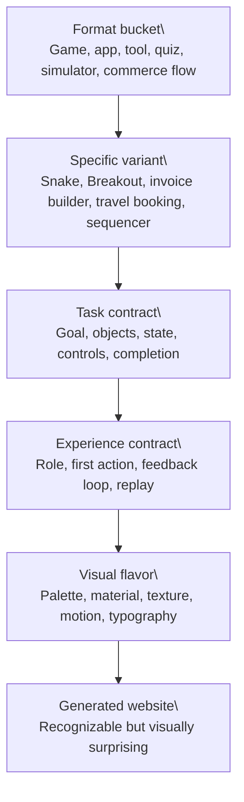
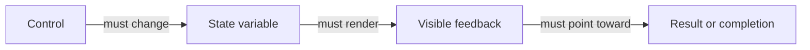

# Task-Model-First Generation

Roulette uses randomness, but it should not feel like random words glued onto sliders. The task-model layer makes each generation start from a recognizable mini-product before the LLM adds strange art direction.

## Core Rule

```text
Concrete format first.
Task model second.
Experience and visual flavor third.
```

The selected format is the product. Semantic anchors are styling and content flavor. They must not rename, replace, or obscure the format.



## Task Contract

Every concrete variant should resolve to a task contract:

- `format`: recognizable user-facing format.
- `user_goal`: what the visitor is trying to accomplish.
- `domain_objects`: objects the page must contain.
- `state_variables`: values that must change as the visitor interacts.
- `controls`: controls that must be visible and connected to state changes.
- `completion_condition`: what success, finish, export, booking, win, or result looks like.
- `error_states`: conditions that prove the page has real rules, not just decoration.
- `allowed_patterns`: UI patterns that fit the format.
- `visual_budget`: how much ambient visual treatment is allowed.



## Good vs Bad

Strong output:

```text
A Breakout game with a paddle, ball, bricks, score, lives, restart, keyboard/touch controls, and a visible win/loss state. The styling can be unusual, but the game remains recognizable.
```

Weak output:

```text
An “Echo Migration” page with glowing panels, sliders, mysterious text, and no clear rules or payoff.
```

The weak output may look polished, but it does not define a durable activity.

## Advisory Gates

Task-model failures should usually become repair signals, not hard product blocks:

- `task_objects_missing`
- `state_model_missing`
- `planned_controls_not_rendered`
- `completion_condition_missing`
- `poetic_renaming_of_known_format`
- `semantic_anchor_overrides_activity`
- `abstract_metaphor_dominates_ui`
- `slider_only_activity`

Hard preflight remains for unsafe, broken, non-renderable, duplicate, or unusable output. Taste and coherence signals should feed prompt repair, diagnostics, and evals.

## Where This Lives

- `api/generation/task_grammar.py`: task-contract registry and fallback task contracts.
- `api/generation/experience_grammar.py`: format-first target construction and compatibility mapping.
- `api/generation/activity_quality.py`: advisory activity and task-contract checks.
- `api/generation/prompts.py`: planner schema requiring `task_contract`.
- `api/llm_client.py`: planner and builder prompts that make the task contract mandatory.
- `api/review_pack.py`: eval rows expose activity score, task fields, and advisory tags.
